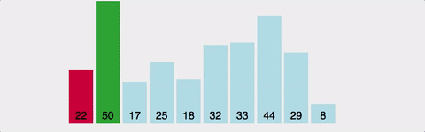
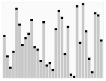
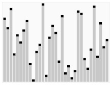

# 정렬 알고리즘
정렬 알고리즘은 개발자에게 매우 기본이 되는 알고리즘이라고 볼 수 있다. 설명할 정렬 알고리즘에 대해서 특징을 살펴보고 가자.  

| 알고리즘 | 시간복잡도    | 안정성  | 특징            |
|------|----------|------|---------------|
| 버블정렬 | O(n²)    | 안정적  | 단순하지만 비효율적    |
| 선택정렬 | O(n²)    | 비안정적 | 바교 횟수 많음      |
| 삽입정렬 | O(n²)    | 안정적  | 거의 정렬된 배열에 적합 |
| 병합정렬 | O(nlogn) | 안정적  | 대규모 데이터에 적합   |
| 퀵정렬  | O(nlogn) | 안정적  | 평균적으로 매우 빠름   |
| 힙정렬  | O(nlogn) | 비안정적 | 힙 자료 구조 활용    |

## 1. 버블정렬

### 과정
1. 배열의 첫번째 요소와 두번째 요소를 비교하여 필요시에 Swap한다.
2. 다음 요소로 이동하여 비교와 Swap을 반복한다.
3. 1회전하고 나면 가장 큰 배열의 값이 마지막에 위치한다.
4. 마지막 요소를 제외하고 반복하면 된다.

### 코드
```c++
void bubbleSort(int arr[], int n) {
    for (int i = 0; i < n-1; i++)
        for (int j = 0; j < n-i-1; j++)
            if (arr[j] > arr[j+1]) {
                int temp = arr[j];
                arr[j] = arr[j+1];
                arr[j+1] = temp;
            }
}
```

사실 이 과정은 정렬의 기본적인 과정이다. 오름차순으로 정렬한다고 했을때, 첫번째와 두번째 값을 비교하면서 첫번째 값이 크다면, 두번째 값과 바꾸고 아니라면 무시하면 된다.

시간 복잡도는 O(n^2)이다. 구현은 매우 직관적이기 때문에 간단하다. 하지만 굳이 바꿔도 되지 않아야 할 요소들을 바꾸는 것때문에 거의 사용되지 않는다.
## 2. 선택정렬

### 과정
1. 배열에서 가장 작은요소를 찾아 첫번째 요소와 교환한다.
2. 두번째 요소부터 이를 반복한다.

### 코드
```c++
void selectionSort(int arr[], int n) {
    for (int i = 0; i < n-1; i++) {
        int min_idx = i;
        for (int j = i+1; j < n; j++)
            if (arr[j] < arr[min_idx])
                min_idx = j;
        int temp = arr[min_idx];
        arr[min_idx] = arr[i];
        arr[i] = temp;
    }
}
```

선택정렬은 오름차순이라고 가정한다면 가장 작은 요소를 찾는다. 그리고 그 값을 첫번째 요소와 교환을 하며, 또 첫번째 방법을 제외한 남은 배열들로 최소값을 찾고 이를 반복한다.

시간복잡도는 O(n^2)이다. 자료 사이즈를 알고 있으면 자료 이동 횟수가 미리 결정(n-1)된다.교환횟수는 3(n-1)로 swap의 이동횟수를 포함한다.

버블정렬과 다른건 하나만 알고 있으면 된다. 한개의 요소를 골라서 비교하고 이를 반복한다.

## 3. 삽입정렬

### 과정
1. 두번째 요소부터 시작하여 그 요소가 정렬된 부분에 삽입한다.
2. 다음 요소로 이동하여 이를 반복한다.
### 코드
```c++
void insertionSort(int arr[], int n) {
    for (int i = 1; i < n; i++) {
        int key = arr[i];
        int j = i - 1;
        while (j >= 0 && arr[j] > key) {
            arr[j + 1] = arr[j];
            j = j - 1;
        }
        arr[j + 1] = key;
    }
}
```
삽입정렬은 두번째 요소를 키값으로 활용한다. 두번째 요소를 Key값으로 설정하고 key요소의 뒤 요소부터 처음요소까지 비교를 한다. 비교후에 key 요소보다 크다면 swap을 하며 key요소보다 작은 요소를 만나면 중단하고 key를 두번째 요소로 준다. 이 과정을 마지막 요소가 key가 될때 까지 반복하게된다.

삽입정렬은 O(n^2)이다. 요소들이 적을 경우 매우 간단하게 동작하지만 요소가 많을 수록 적합하지 않은 방식이다.

삽입정렬은 배열의 두번째 요소를 key로 설정하여 뒤부터 검사를 진행한다는 것을 알고 있으면 알고리즘 방법을 떠올리기 쉬울것이다.

## 4. 병합정렬

### 과정
1. 배열을 두 부분으로 나눈다.
2. 각 부분을 재귀적으로 병합 정렬한다.
    - 병합정렬
    1. 요소가 하나의 요소가 될때가지 분할한다.
    2. 요소를 합칠때 정렬한다.
3. 두정렬을 합친다.
### 코드
```c++
void merge(int arr[], int l, int m, int r) {
    int n1 = m - l + 1;
    int n2 = r - m;
    int L[n1], R[n2];
    for (int i = 0; i < n1; i++)
        L[i] = arr[l + i];
    for (int j = 0; j < n2; j++)
        R[j] = arr[m + 1 + j];
    int i = 0, j = 0, k = l;
    while (i < n1 && j < n2) {
        if (L[i] <= R[j]) {
            arr[k] = L[i];
            i++;
        } else {
            arr[k] = R[j];
            j++;
        }
        k++;
    }
    while (i < n1) {
        arr[k] = L[i];
        i++;
        k++;
    }
    while (j < n2) {
        arr[k] = R[j];
        j++;
        k++;
    }
}

void mergeSort(int arr[], int l, int r) {
    if (l < r) {
        int m = l + (r - l) / 2;
        mergeSort(arr, l, m);
        mergeSort(arr, m + 1, r);
        merge(arr, l, m, r);
    }
}
```
병합 정렬의 핵심이론은 Divide Conquer (분할정복)이다. 분할정복은 쉽게 이해를 할 수 있는데, 문제를 작은 문제로 나누어서 문제를 각각 해결한 다음, 결과를 모아서 원래 문제를 해결하는 전략이다. 분할 정복은 대부분 순환 호출(재귀적)을 통해 구현을한다.

시간복잡도는 O(nlogn)으로 최악과 최선이라 동일하다. 즉, 이 말은 어떤 데이터가 와도 동일한 결과를 갖고 있음을 이야기한다.

## 5. 퀵정렬

### 과정
1. 피벗을 기준에 맞게 선택한다.
2. 피벗보다 작은 요소는 왼쪽에, 큰요소는 오른쪽에 놓는다.
3. 피벗을 기준으로 배열을 분할하여 재귀적으로 정렬한다.
    - 분할정복
    1. 분할: 피벗을 기준으로 비균등하게 2개의 부분 배열로 분할한다.
    2. 정복: 부분 배열을 정렬한다. 부분 배열의 크기가 정렬하기에 작지 않으며 다시 분할정복을 활용한다.
    3. 결합: 정렬된 부분 배열들을 하나의 배열에 합병한다.
### 코드
```c++
int partition(int arr[], int low, int high) {
    int pivot = arr[high];
    int i = (low - 1);
    for (int j = low; j <= high - 1; j++) {
        if (arr[j] < pivot) {
            i++;
            int temp = arr[i];
            arr[i] = arr[j];
            arr[j] = temp;
        }
    }
    int temp = arr[i + 1];
    arr[i + 1] = arr[high];
    arr[high] = temp;
    return (i + 1);
}

void quickSort(int arr[], int low, int high) {
    if (low < high) {
        int pi = partition(arr, low, high);
        quickSort(arr, low, pi - 1);
        quickSort(arr, pi + 1, high);
    }
}
```
퀵 정렬도 마찬가지로 분할정복 알고리즘을 활용하여 정렬을 한다. 문제는 피벗에 따라 시간복잡도가 달라질 수가 있는 비균등 정렬에 속한다. 그렇기 때문에 피벗을 선택할때는 잘 선택해야한다. 피벗을 선택하는 조건은 중간값을 선택하는 경우도 많다.

## 6. 힙정렬

>🥕 힙(Heap)  
Heap은 개발을 학습하다보면 자주 등장하는 용어이다. 완전 이진트리구조체가 우선순위 큐를 위하여 만들어진 자료구조라고 생각하면 된다. 즉, 우선순위 큐를 구현하기 위해서는 힙으로 구현을 할 수 있다. 힙을 선형 자료구조인 배열로 구현하고 그 구현체를 다시 힙으로 구현할 수 있다는 것이다.



### 과정
1. 배열을 힙 구조로 변환한다.
2. 최대 힙 또는 최소 힙에서 루트 요소를 제거하고 정렬된 배열에 추가한다.
3. 힙을 재구성하여 정렬을 반복한다.
### 코드
```c++
void heapify(int arr[], int n, int i) {
    int largest = i;
    int left = 2 * i + 1;
    int right = 2 * i + 2;
    if (left < n && arr[left] > arr[largest])
        largest = left;
    if (right < n && arr[right] > arr[largest])
        largest = right;
    if (largest != i) {
        int temp = arr[i];
        arr[i] = arr[largest];
        arr[largest] = temp;
        heapify(arr, n, largest);
    }
}

void heapSort(int arr[], int n) {
    for (int i = n / 2 - 1; i >= 0; i--)
        heapify(arr, n, i);
    for (int i = n - 1; i > 0; i--) {
        int temp = arr[0];
        arr[0] = arr[i];
        arr[i] = temp;
        heapify(arr, i, 0);
    }
}
```
특징은 힙의 종류는 최대 힙, 최소 힙으로 나누어져 있다.
- 최소힙 ➡️ 오름차순 구현
- 최대힙 ➡️ 내림차순 구현

시간복잡도는 O(nlogn)이다. 힙은 우선순위큐를 만드는 자료구조다. 힙 정렬이 바로 우선순위 큐를 만드는 핵심이라고 볼 수 있다.

---
# FINAL

자주 등장하는 정렬알고리즘에 대해서 알아보았다. 사실 구현하기 복잡할 수록 시간복잡도에서 유리한 측면을 갖고 있다. 또한 Key:Value구조에서는 정렬알고리즘의 안정정도 따져야한다.


