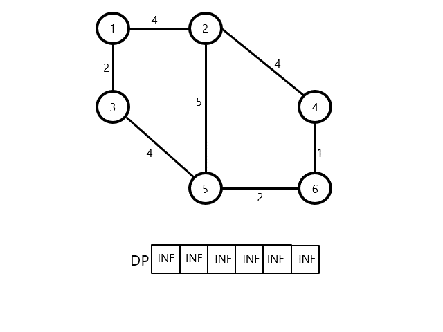
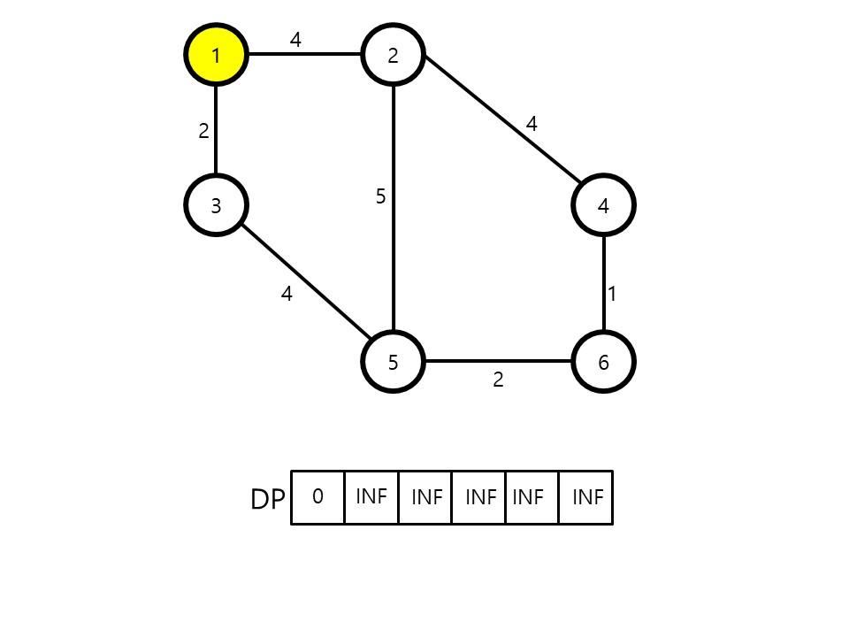
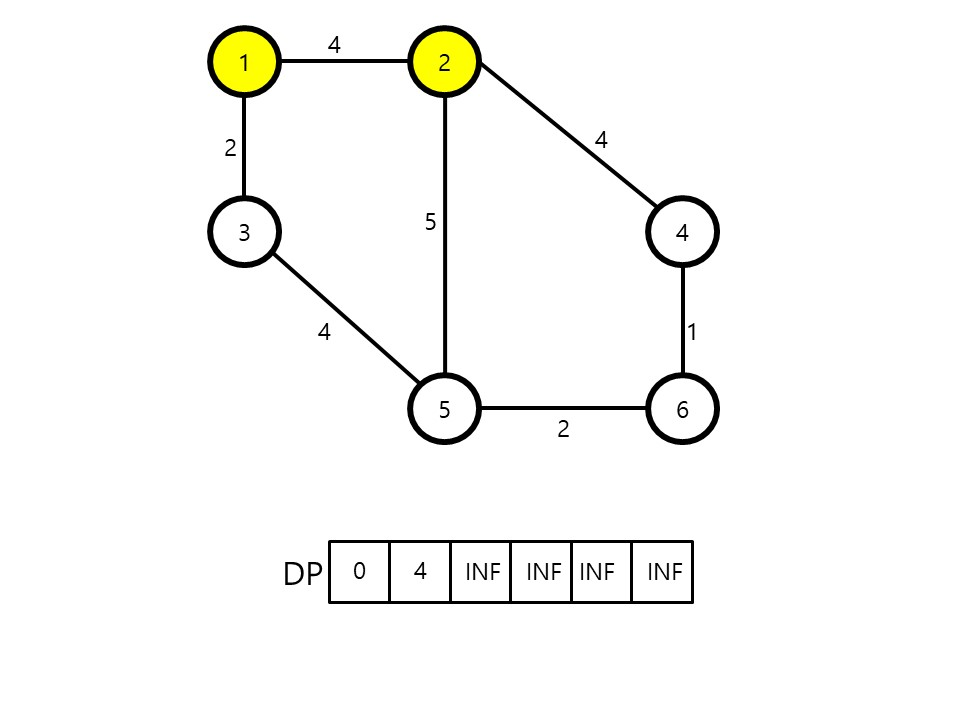
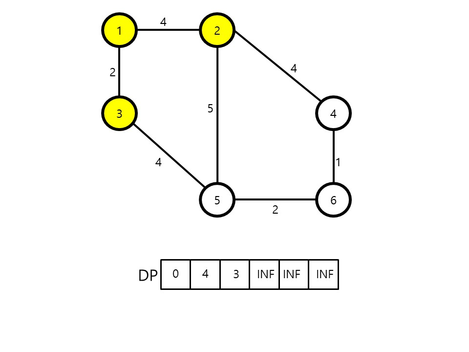
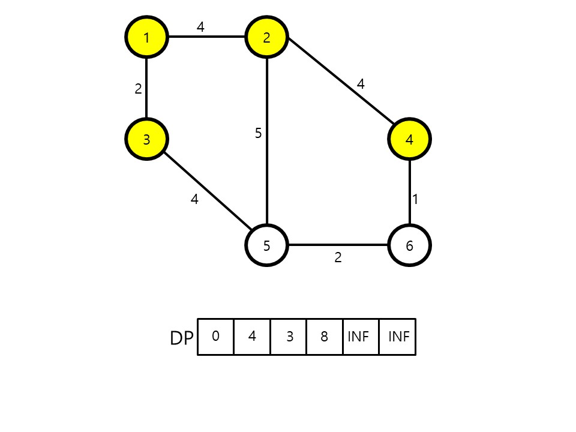
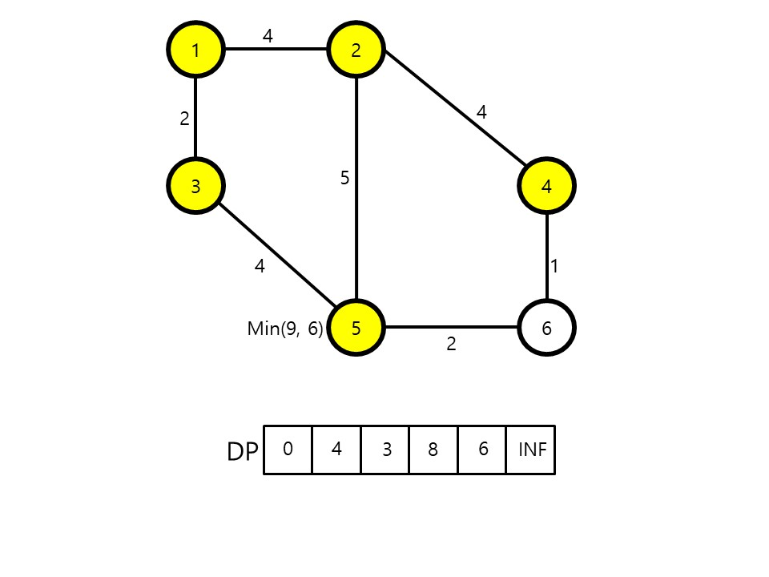
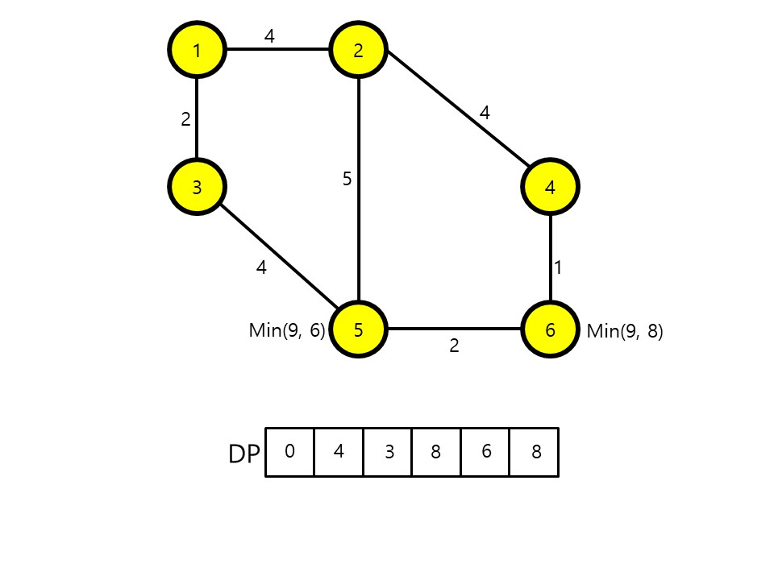

# Dijkstra's algorithm

Dynamic Programing을 활룡한 대표적인 `최단경로 탐색 알고리즘`이다. 그래프에서 `Minimum Cost`를 도출해내야한다.

인공위성의 GPS 소프트웨어에서 가장 많이 사용된다. 특정한 하나의 정점에서 다른 모든 정점으로 가는 최단 경로를 알려준다. 하지만 음의 간선에서는 Dijkstra's algorithm을 활용할 수 없다.

## Detail

위의 애니메이션을 살펴보고, 하나씩 뜯어보면서 설명을 하겠다.

1. DP배열을 Edge만큼 생성한다.
2. DP배열에 INF(Infinite)값을 Fill한다. (예, int 타입은 int의 max value 등등)
   
3. 시작 Edge의 index에 위치한 DP[시작점]은 0으로 초기화한다.
   
4. 시작점으로 부터 목적지점까지 하나씩 방문하면서 가중치 값을 DP배열에 넣는다.
   
   
   
5. Fan-In이 여러개라면 최소값을 찾아서 DP배열에 넣는다.
   
   
6. 그후 최종지점의 DP 값을 확인하여 최단거리 경로를 찾는다.
   

---
# FINAL
어려운 내용은 아니다. 다익스트라는 코테에 자주 나오기때문에 문제를 풀어보면 좋다.
- [백준 1753](https://www.acmicpc.net/problem/1753)
- [백준 13549](https://www.acmicpc.net/problem/13549)
- [백준 1916](https://www.acmicpc.net/problem/1916)

