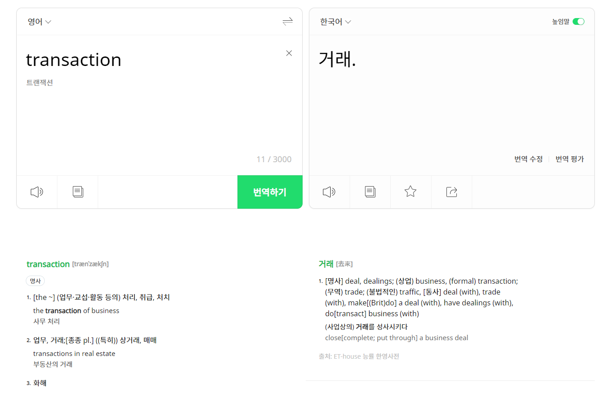

# 개요

데이터베이스를 학습하다보면 정규화, 트랜잭션이 자주 등장한다. 심지어는 스프링에서 개발할때도 `@Transaction` 어노테이션이 있다. 그렇다면,
트랙젝션은 무엇일까?

## 사전적 의미와 Transaction

파파고에 Transaction을 검색하면 `거래`라고 나온다. 뭔가를 주고 받는 의미로 파악 할 수 있다.

그렇다면, 데이터베이스에서는 어떤 뜻일까?  

`데이터베이스의 상태를 바꾸기 위해 수행하는 작업의 단위`를 말한다. 만약에 작업이 중단된 경우
처음부터 가시 실행하는 Rollback을 수행하고, 오류없이 실행을 마치면 Commit을 수행하는 `논리적단위`라고 볼 수 있다.

사전적 의미와의 관계로는 `거래`라는 용어를 뜯어보면 더 이해하기가 쉽다. 우리가 `거래`리고 칭하는 과정을 살펴보자. 두 당사자 간의 거래나 교환을 의미한다.
이 과정에서 무언가를 주고 받는다면, `거래/교환`이 성사되었다고 본다. DB에서도 이 개념이 동등하게 적용이된다. DB에서 Transaction은 일련의 DB작업을 하나의 논리적 단위로 
묶어서 다루는 것이다.

조금 더 이해하기가 쉬워졌다고 생각한다.

## ACID 특성

Transaction에는 일반적으로 특성을 4가지로 구분할 수 있다.

- Atomicity(원자성)
- Consistency(일관성)
- Isolation(독립성)  
- Durability(지속성, 영속성)

각각의 특성을 이해해보자.

### Atomicity(원자성)
Transcation이 모든 작업이 성공적으로 완료되거나, 전혀 완료되지않아야한다. 쉽게 말해 두가지 조건만 갖고 있다. `All Or Noting` 즉, 트랜잭션 중 하나라도 실패하면
모든 변경 사항이 되돌려져야(RollBack)되어야한다.

일상생활에서 좋은 예시를 찾을 수 있다. 많은 비유가 은행 송금이지만 좀 더 쉽게 이해하기 위해 자판기를 예시로 들어보자.  

> 🔥 Atomicity Realworld  
> 
> 자판기에서 음료를 뽑기 위해 자판기에 돈을 넣었다. 그리고 음료를 선택하니깐 자판기의 오류로 음료가 나오지 않았다. 그렇다면 자판기는 어떻게 해야할까?
> 
> 당연히 돈을 뱉어내야한다. 나한테 음료가 오지 않았기 때문이다. 정당한 거래 성사를 위해서는 `Atomicity`을 가져야한다. 음료가 나오는 작업과 돈이 차감되는 작업이
> 동시에 성공을 해야만이 `거래`가 성사되었다고 볼 수 있다. 둘중 하나라고 실패하면, 처음으로 돌아가야한다.

### Consistency(일관성)
트랜잭션이 완료되면 데이터베이스는 항상 일관된 상태를 유지해야 합니다. 즉, `Commit`이 되어야한다.

더 나은 이해를 위해 일상생활에서 찾아보자.

> 🔥 Consistency Realworld  
> 
> 파일럿들은 항공기 이륙전에 항공기에 대한 점검을 한다. 기름이 잘 채워져있는지, 랜딩기어엔 이상이 없는지,기체 외관에 문제는 없는지, 엔진에는 이상이 없는지 확인후에
> 각 항목이 적절히 확인 되어야 항공기는 이륙을 할 수 있다. 하나라도 문제가 생기면 이륙이 불가능하다. 그렇다고 비행기가 뜰때 비행기의 이상이 생기면 안되는 것 처럼 비행기 안전 체크리스트를 점검한후에는
> 비행기가 완전히 이륙할 준비가 되었다는 궁긍적인 목표가 변할 수는 없다. 즉, 이륙전 이륙의 상황에서 `Consistency`이 있어야한다.

### Isolation(독립성) 
각 트랜잭션은 독립적으로 실행되어야 하며, 다른 트랜잭션의 영향을 받지 않아야 합니다. 트랙잭션끼리 섞이면 안된다는 의미이다.

> 🔥 Isolation Realworld
> 
> 은행창구에서 돈을 여러 고객이 동시에 돈을 인출학게 된다. A고객이 돈을 인출하고 있을때, B의 고객의 인출이 A고객의 작업에 영향을 주어선 안된다.
> 즉, 과정중에 은행의 돈이 모잘라서 A의 인출이 불가능하면 안된다는 것이다. 이게 `Isolation`을 이야기한다.

### Durability(지속성, 영속성) 
트랜잭션이 완료된 후에는 그 결과가 영구적으로 반영되어야 합니다. 사실 당연한 소리이다. 반영이 되면 그 값이 변경되면 안된다.
트랜잭션의 결과는 시스템 장애 등이 발생하더라도 영구적으로 유지됩니다.

> 🔥 Durability  Realworld
>
> 중요한 이메일을 회사의 인사팀에 보냈다. 이메일 서버에서는 이메일을 성공적으로 도착했다고 하였다. 이 과정은 이메일이 한번 전송된 후에 성공했다면 전송되었고, 전송된
> 이메일은 사라지지 않는다. 이게 `Durability`을 의미한다.

---

사실 위의 ACID는 일상생활에서 보면 매우 당연한 이야기이지만 이를 구현하는 과정은 직관적이지 못해서 특성들을 정리해야한다. 백엔드 엔지니어들이 자주 하는 실수가
중간에 Insert중 다른 테이블에서 서버오류 500이 발생했는데 한테이블에는 들어가고 다른 테이블에는 안들어가는 Tracnstion의 특성이 지켜지지 않는 오류를 많이 범한다.
그렇기 때문에 ACID에 대해서 알고 있는 것이 중요하다.

- 원자성: 모든 작업이 완료되거나 아무 것도 완료되지 않아야 한다. (자판기에서 음료수 받기)
- 일관성: 트랜잭션 전후의 시스템 상태가 올바르게 유지되어야 한다. (항공기 체크리스트 점검)
- 독립성: 각 트랜잭션은 서로 독립적으로 수행되어야 한다. (은행 창구에서의 동시 인출)
- 지속성: 트랜잭션 결과는 영구적으로 반영되어야 한다. (이메일 송신 확인)

기억나지 않는다면, Realworld의 예시를 떠올려보자!

