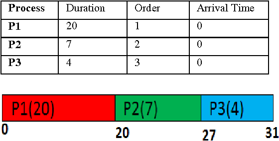
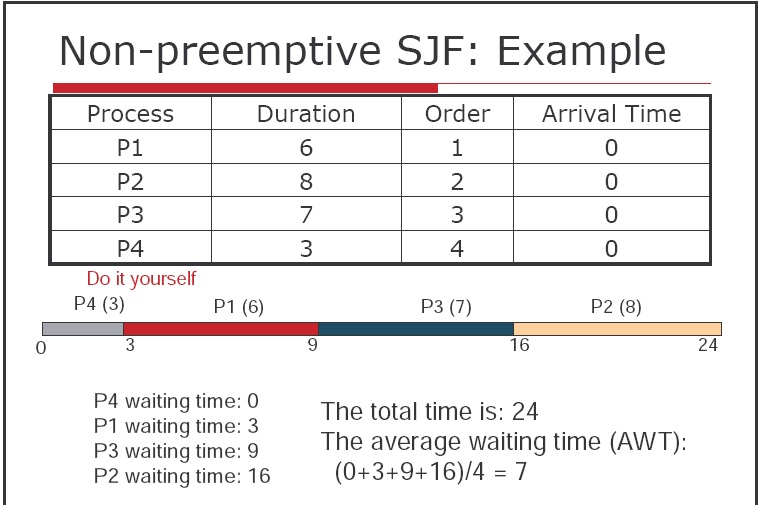
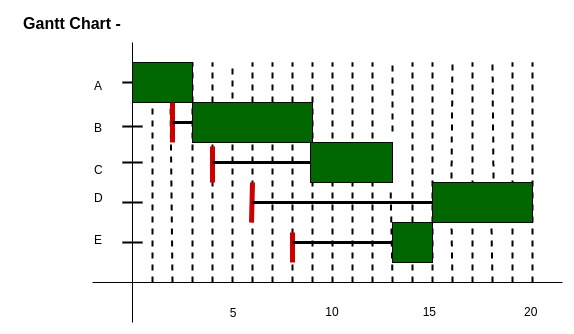
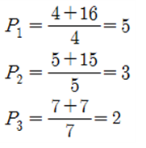
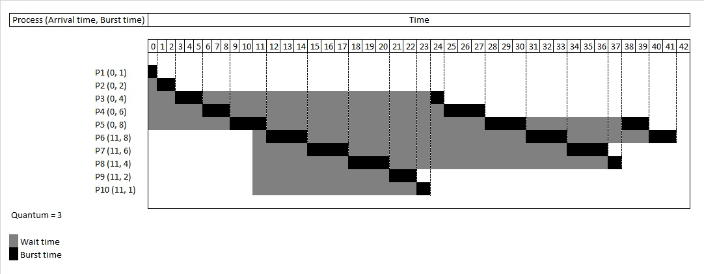
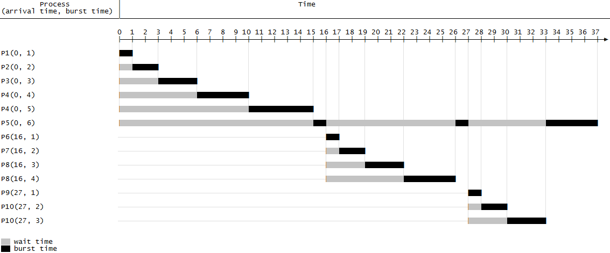
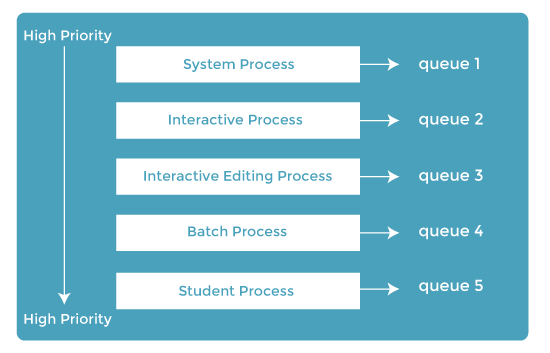
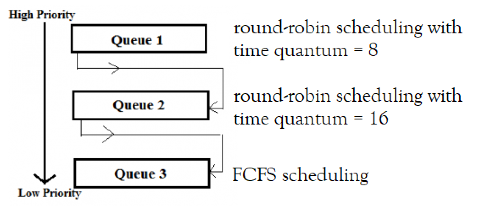

# 개요

PC를 사용할때는 한가지 프로그램만 돌아가지 않는다. "멀티 프로그래밍"이라고 하며, 멀티 프로그래밍에서 가장 중요한건 CPU 이용률을 최대화하는 것이다. 어떤 Process가 Wating State, Terminated로 들어가면 CPU 자원을 회수하여 다른 Process에 할당한다.

CPU 이용률을 극대화하여 CPU를 놀지 못하게 하는게 [Muti Programing](/blog/posts/operatingsystem/os-muti-processing-vs-muti-thread/)의 Core가 된다.

## 복습

[Process State](/blog/posts/operatingsystem/os-processs/#process-status-5가지-상태)를 알아볼때 Waiting State의 Process는 Ready Queue에 있다가 프로세스 중 하나를 선택하여 CPU 자원을 할당(Dispatch)하게 된다.

> 🥕 Dispatch
> Dispatch는 "(특별한 이유를 위해)보내다", "발송"하다라는 의미가 있는데 CPU의 스케듈러 쪽으로 Ready 상태에 있는 프로세스나 쓰레드를 Running 상태로  "대기가 끝나 준비 상태이니 특파로 보낸다"라는 의미로 이해하면 될거같다.

그렇다면 어떤 방식으로 선택을 한다는 것일까?

선택하는 방법이 "CPU Scheduling"이다.

# CPU Scheduling

언제 [CPU Scheduling](/blog/posts/operatingsystem/os-processs/#status-transition-상태-전이)이 발생하는지 부터 알아보자.

1. Running ➡️ Waiting
2. Waiting ➡️ Ready
3. Running ➡️ Waiting
4. Terminated

4가지 Transition 상태에서 CPU 스케듈링이 일어날 수 있다. CPU 자원을 Dispathch하고 다 쓰고 놓아줄때 다음 Process가 할당하기 위해서 스케듈링이 발생한다고 생각하면, 암기나 이해가 용이하다.

또한, CPU 스케듈링을 크게 2가지로 나눌 수 있는데, 비선점형(Non-Preemitive Scheduling)/선점형(Preemitive Scheduling) 으로 나눌 수 있다.

## Non-Preemitive Scheduling

DeadLock[url]의 발생조건중 하나인 비선점을 알고 있다면 더 이해하기가 쉽다. 다시 설명하자면, Non-preemitve Scheduling은 한 프로세스가 CPU를 사용(CPU Burst)하고 있으면 사용이 완료될때까지, 사용을 하지 못한다.

비선점의 뜻을 알고 있을때는 좋아보이는 스케듈링 기법은 아닌 것 처럼보인다. 하지만 장점은 비선점으로 시스템을 돌리게 되면 일괄처리 방식으로 처리가 되어 Batch System에서 엄청난 장점이 있고 Process 동기화를 하지 않아도 된다. 또한, 비선점은 인터럽트를 허용하지 않는다.

### FCFS(First Come First Served)

뜻 풀이대로 들어온 순서대로 CPU 자원을 할당하는 것이다. 해당 방법은 매우 직관적이지만, Convoy Effect가 발생한다.

> 🥕 Convoy Effect  
생각해보면, 캐셔라인이 하나인 마트에 가서 박카스 한병을 살려고 기다리고 있다. 근데 앞에 아줌마가 50개의 물품을 사고 있다. 박카스를 한병 사기 위해서 앞 아줌마를 무조건 기다려야한다.
>
> Convoy Effect란, CPU를 오랜동안 사용하는 Process를 상대적으로 CPU를 덜 사용하는 Process들이 기다라는 효과를 말한다. Starvation이랑 비교하는 질문이 많이 나온다.

### Non-Preemitive SJF(Shortest Job First)

해당 scheduling은 최소 작업 우선 스케듈링이다. 수행시간(CPU Burst)이 짧은 순으로 "우선순위"를 사용하여 짧은 순서대로 CPU 자원을 할당하는 것을 의미한다.

단점으로는 CPU Burst Time이 긴 Process는 Starvation이 된다.

> 🥕 Starvation(기아 상태)
>
> **"우선순위"** 를 기반으로 하는 Scheduling에서 발생하는 현상이다. 우선순위에서 지속적으로 밀려 처리되지 못하는 Process를 기아상태라고 이야기한다.

### HRN(Highest Response-ratio- Next)

Non-Preemitive SJF의 단점인 Starvation을 극복하기 위해 "Waiting Time"을 도입하여 대기시간이 길어지면 응답률이 높아지도록 설계했다.

> 🤔 HRN 우선순위의 기준
>
>(Waiting Time + CPU Burst Time) / CPU Time
> 

## Preemitive Scheduling

비선점형 스케듈링의 특징 중 하나는 Interrupt가 허용되지 않는다는 것이다. 하지만 선점형 스케듈링은 Interrupt가 허용이 된다. Interrupt 허용된다는 것은 "우선순위"가 발생한다는 것이고, 선점형은 우선순위에서 발생되는 Starvation에 어떻게 해결할 것인가를 고민해야한다.

또한, 비선점에서 발생하지 않는 Context Switching에 따른 OverHead도 고려해야한다. 이 두가지를 기억하고 선점형 스케듈링에 대해서 살펴보자.

### Round Robin(RR) Scheduling

Roud Robin의 어원은 리그전이라는 의미이다. 한번씩 모든 경기를 치룬다는 의미가 있다. 마찬가지로 Round Robin CPU Scheduling 기법은 Time Quantum(시간단위)로 CPU 할당을 진행한다. 누구든 한번씩 CPU Burst Time을 가진다는 것이다.  
즉, Time Quantum으로 CPU Burst Time이 주어지며, 실행이 완료된 Process는 Ready Queue의 맨 뒤로 가고 다음 순번이 기다리게 된다.

Time Quantum은 10ms ~ 100ms로 측정된다. 프로세스가 10개가 들어오면 10개를 시간단위에 맞춰 Context Switching을 해야하기 때문에 OverHead가 크다.
하지만 Process마다 Response Time이 짧기 때문에 실시간 시스템에 유리하다.

Round Robin은 알고 있어야한다. 분산형 구조의 네트워크 환경에서도 LoadBalancer에서도 등장한다.

### Preemitive SRTF(Shortest Remaining Time First) Scheduling

비선점 SRTF와 다르게 선점형 SRTF는 Process 실행시간이 적은 순으로 우선순위를 결정하게 된다. 새로운 Process가 실행시간이 짧은게 들어올때만 Context Switching이 발생하여 OverHead가 발생한다.

위의 그래프를 보면, Process5이 실행되고 있는중에 Process6의 들어왔을때 Process6이 선점을 하게된다. 그 뒤로 Process7, Process8, Process9 가 실행되고 다시 Process 5가 샐행이된다.

우선순위가 있는 환경에서는 Starvation이 발생한다.

### MutiLevel Queue (MLQ) Scheduling(다단계 큐 스케듈링)

Waiting State Process는 Ready Queue에 들어가서 기다리게 된다. 이 Ready Queue를 여러개로 분리하며 Queue마다 우선순위를 설정하여 Scheduling하는 기법이다. 이렇게 되면 Ready Queue마다 다른 Scheduling기법을 갖고 갈 수 있다. 단점은 Queue에 들어가면 다른 Queue로 이동이 불가능하다는 것이다.

역시나 우선순위가 있기 때문에 Starvation이 발생한다.

### MutiLevel feedback Queue(MLFQ) Scheduling(다단계 피드백 큐 스케듈링)

여럽게 생각하지 않아도 된다. MLQ가 동적으로 프로세스의 우선순위가 결정된다는 것이다. MLQ의 큰 문제점인 Queue에 들어가면 다른 Queue로 이동하는 것이 불가능한 유연성이 떨어지는 단점을 해결한다. RR처럼 Process 자체에 Time Quantum을 사용하는 것이 아닌 Queue 자체에 Time Quantum을 활용하여 우선순위가 높을 수록 Time Qunatum의 주기가 짧게 된다. 또한, Queue간 이동이 가능하다.

> 🥕 Aging 기법
> Starvation을 해결하기 위한 기법으로 특정 Process가 Starvation이 되면 일정시간마다 우선순위를 한단계씩 높여주는 방식이다.

## 평가기준

그렇다면 어떤 스케듈링 기법이 이상적인 스케듈링 기법일까?

- CPU Utilization(사용률)
- Throughput (처리량)
- Response Time(응답 시간)
- Wait Time(대기 시간)
- Turnaround Time(반환 시간)

### 이상적인 CPU Scheduling

| 항목              | 기준 |
|-----------------|----|
| CPU Utilization | ⬆️ |
| Throughput      | ⬆️ |
| Response Time   | ⬇️ |
| Wait Time       | ⬇️ |
| Turnaround Time | ⬇️ |

위처럼 발전하고 있지 않을까 싶다. 사실 지금 작성한 내용은 Classcial하다. 현 시대의 OS들은 장비에 맞춰 더 엄청난 기술적 도약을 한 상태이다.

---
# FIANL
CPU 스케듈링은 이해를 하는 것도 중요하지만 주어진 문제가 있을때 풀어내는 것도 매우 중요하다. 몇가지 문제를 찾아서 한번 풀어보자.

