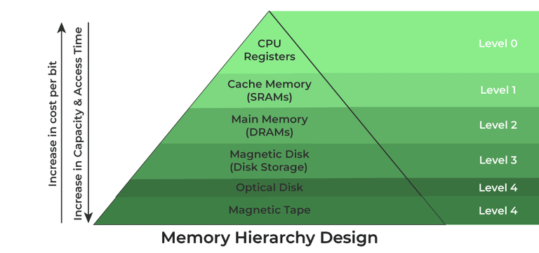
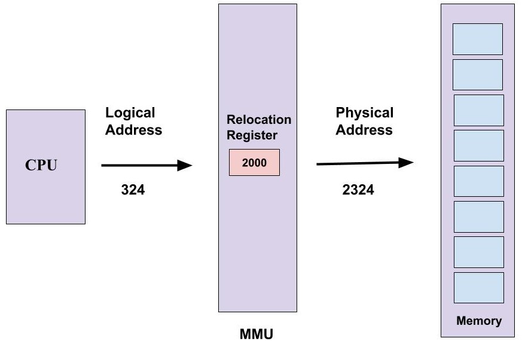

# 개요

앞서 살펴본 내용들은 CPU, Process에 관한 내용들을 주로 보았다. 하지만, 컴퓨터의  Main이 되는 Resourece에 Memory가 있다. 한번씩은 Memory와 Cost의 피라미드 구조를 본적이 있다.

이렇게 Program에 접근하려면 Main Memory에 있어야하며 CPU는 Program Counter 값에 따라 메모리에서 명령을 가져옵니다.

Memory의 구조는 배열 이라고 생각하면된다. 메모리는 각각 고유한 위치(Address)를 갖고 있다. Muti-Programing과 Memory는 밀접한 관련이 있으며 효율적 Programing환경을 위해서는 Memory Management가 중요하다.

## Physical  Address & Logical Address (Virtual Memory)

먼저 메모리 전략을 이해하기전에 메모리의 주소 공간을 알고 넘어가야한다.

### Physcial Address (물리 주소)

해당 주소 공간이 메모리 입장에서 바라보는 주소이다. 메모리는 사실 엄청나게 큰 구조의 배열로 저장되어 있으며 메모리에 매겨져있는 인덱스 값이라고 생각하면 좋다.

### Logical Address (논리주소, 가상 메모리)

실제로 존재하는 것은 아니다. CPU에서 자체적으로 프로그램중에 생성하게 된다. 실제 메모리에 바인딩 되는 것이 아닌, CPU입장에서 Memory Address이다. 크기는 Process의 사이즈로 결정되며 언제든지 변경될 수 있다. 그리고 자체적으로 만드는 주소 체계이기 때문에 0부터 시작하게 된다. 이는 불연속적 메모리 관리 차원에서 접근할 수 있는 물리 주소공간보다 한 단계 높은 차원이다.

### MMU(Memory Management Unit)

CPU입장에서 바라보는 논리 주소가 리얼 월드에 물리 주소로 맵핑이 되려면 Memory Management Unit가 담당한다. **MMU는 PC의 하드웨어로 구현**되어있어서, 빈번하게 일어나는 Mapping에 대응 할 수 있다.

## Memory Management

먼저 왜? 이런 Memory 관리 전략이 필요한지 알아야한다. 위에서 잠깐 나온 이야기이지만 Multi Programing 환경에서 Process가 교환되며 Ready Queue에 들어갔다 나가면서 CPU 자원도 사용하지만 Memory도 함께 사용한다. [Process의 메모리 구조](/blog/posts/operatingsystem/os-processs/#할당받는-메모리-구조)를 함께 참고하자.

그렇게 CPU Resoure를 받고 Memory도 받으면 Memory에 대한 Utilization이 늘어나게 된다. 시간이 지날수록 Process의 수는 많아질 것이고 Memory는 한정적인 자원이라면, 어떻게 할 것인가? Process를 종료하는 것은 최후의 수단이다. 적은 자원으로 최고의 효율을 내기 위한
전략을 구성한다.

해당 전략의 목표는 아래와 같다.

- Process 전후로 Memory를 할당/해제
- Process들에 의해서 Memory 사용된 공간을 추적유지
- Fragmentation 이슈를 최소화
- Main memory 사용량을 적절히 분배
- Process 실행동안 Data 일관성 보장

메모리 관리전략은 아래의 Tree구조로 살펴 볼 수 있다. 하나씩 알아보자

- [Memory Allocation](/blog/posts/operatingsystem/os-memory-management/#memory-allocation)
    - [Fixed Partioning](/blog/posts/operatingsystem/os-memory-management/#고정-할당fixed-partitioning)
    - [Dynamic Partioning](/blog/posts/operatingsystem/os-memory-management/#동적-할당dynamic-partitioning)
        - [Best Fit](/blog/posts/operatingsystem/os-memory-management/#최초-적합first-fit)
        - [First Fit](/blog/posts/operatingsystem/os-memory-management/#최적-적합-best-fit)
        - [Worst Fit](/blog/posts/operatingsystem/os-memory-management/#최악-적합-worst-fit)
    - [Segmentation (분할 할당)](/blog/posts/operatingsystem/os-memory-management/#분할-할당segmentaion)
- [Swapping](/blog/posts/operatingsystem/os-memory-management/#swapping)
- [Virtual Memory](/blog/posts/operatingsystem/os-memory-management/#virtual-memory)
    - [Paging](/blog/posts/operatingsystem/os-memory-management/#paging)
        - [Pre-Paging(Anticipatory paging, 예상 페이징)](/blog/posts/operatingsystem/os-memory-management/#pre-paging)
        - [Demand Paging(Lazy Loading)](/blog/posts/operatingsystem/os-memory-management/#demand-paging)
            - [FIFO](/blog/posts/operatingsystem/os-memory-management/#fifofirst-in-first-out)
            - [LRU](/blog/posts/operatingsystem/os-memory-management/#lruleast-recently-used)
            - [LFU](/blog/posts/operatingsystem/os-memory-management/#lfuleast-frequently-used)
            - [MFU](/blog/posts/operatingsystem/os-memory-management/#mfumost-frequently-used)
            - [Optimal](/blog/posts/operatingsystem/os-memory-management/#optimal)
    - [Segmentaion(세그먼테이션)](/blog/posts/operatingsystem/os-memory-management/#segmentation)
---

# Memory Allocation

Memory Allocation는 총 3가지로 나눌 수 있다. 그리고 많은 메모리 관리 기법을 이야기할때  Cognitious Memory /Non- Cognitious Memory 할당으로 구분하기도 하는데 Memory Allocation은 Cognitious Memory이다.

그렇다면, Cognitious Memory 할당기법을 뭘까?

지속적으로 메모리를 적재하는것이다. 연속적으로 적재함으로써 접근을 더 쉽게 했다. 굉장히 고전적인 방식을 활용다.

## 고정 할당(Fixed Partitioning)

미리 정해진 크기를 Partitioning을 한다. 그리고 Partitioning된 자리에 Load를 시킨다.
매우 직관적이지만, 얼마나 비효율적인지 생각해보자.

Process가 Load하는 크기는 매우 다양하다. 어떤 Process는 큰 Memory를 Load하길 원한고 어떤 Process는 작은 Memory를 Load하기 원해서 작은 Process에게 맞출 수 없으니 큰 Process에 맞춰 Partioning을 했다.

어떤 결과가 발생할까?

작은 Process가 적재하는 Memory는 Hole이 생기게 된다. 충분히 하나가 더 들어가거나 남은 자리를 모은다면 하나를  넣을 수 있지만 그렇지 못하게 된다. 우리는 이를 Hole이라고 부르며, Internal Fragmentaion이라고 한다.

## 동적 할당(Dynamic Partitioning)

미리 정해진 크기를 Partitioning하지 않고 Process의 Memory에 맞춰서 Partitioning을 한다.

### 최초 적합(First Fit)

일단 들어오자마자 보이는 Memory Space에 Load를 하는 것이다. 하지만 문제는 Process가 Exited되고 Memory가 blank space가 될때 문제가 생긴다. Exited되는 시간은 무작위이기 때문에 시간이 지날 수록 External Fragmentaion이 발생한다.

### 최적 적합 (Best Fit)

load할 수 있는 Memory를 스캔후에 딱 적합한 메모리에 Load를 한다. 문제는 스캔과정이 오래걸리기 때문에 Load되는 속도가 저하된다.

### 최악 적합 (Worst Fit)

Load할 수 있는 가장 큰 자리에 Memory를 Load한다. 이 적합과정의 문제도 가용 공간들이 정렬되지 않기 때문에 Memory를 Scan하여 최적인 곳을 검색한다.

## 분할 할당(Segmentaion)

이 방법은 Process가 Memory를 Load하는 곳 자체를 물리적 공간으로 나누어 둔 것이다. 대,중, 소로 나누어서 저장한다고 생각하면 이해가 쉽다.

> 🥕 Internal Fragmentaion VS. External Fragmentaion
>
> Memory Load기준으로 생각하면 된다. Internal Fragmentaion는 load되고 나서 빈공간(Hole)을 뜻하는 것이고 External Fragmentaion는 Extied된 Process가 빈공간이 되면서 다음 Process가 들어갈 총 공간은 있지만 중간중간 Fragmentaion가 이루어져있어서 실제로 할당이 불가능한 것을 이야기한다.

이렇게 Memory Allocation, 즉, Cognitious Memory는 Fragmentaion의 문제점이 있다. Compact를 통해서 External Fragmentaion는 해결할 수 있지만, Memory를 스캔해야하기 때문에 CPU 자원을 사용해야하며 Compaction동안 모든 Process를 사용할 수 없게된다. 이를 해결하기 위해서 [Virtual Memory의 Paging]()을 사용하는 것이다.

# Swapping

Swapping은 앞으로 전에 나온 Memory Allocation과도 성격이 조금 다르다. Swapping은 보조기억장치(HDD, SDD)로 주 기억장치에서 사용하지 않는 데이터를 잠깐 옮겼다가 가져오는 것이다. 보조기억 장치로 보내는 것을 Swapped-out, 보조기억장치에서 가져오는것을 Swapped-in이라고 부른다. 사실 어려운 내용은 없다. 그냥 잠깐 보냈다가 다시 가져오는데 워낙 보조기억장치의 I/O 속도가 느려서 완전한 해결책은 아니다.

# Virtual Memory

Non-contigious한 방법으로 물리적 메모리가 아닌 논리적 구조(Address)형태로 저장하면서 Fraction을 해결할 수 있다.

## Paging

Paging방식도 두가지로 메모리에 load하는 방식이 있다. Pre-Paging(Anticipatory paging, 예상 페이징)기법 과 Demand Paging기법 이렇게 나누어져 있다. Pre-Paging은 Load될거 같은것을 미리 Load해오는 것이다. 1차원적이기 때문에, 원하는 CPU에서 필요한 page가 없는 경우도 있기 때문에 Demand Paging기법을 사용한다.

### Pre-Paging

프로세스의 모든 데이터를 미리 물리메모리에 올려놓고 처리를 하게된다. 사실상 현실적이지 않다. 얼마나 많은 Process가 돌줄 알고...??

### Demand Paging

프로세스의 모든 데이터(page)를 물리메모리에 적재하지 않고 필요한 시점에 메모리에 로드한다. 그렇다면 불필요한 데이터(page)들은 어디에 저장할까?

위에서 주기억장치,보조기억장치를 사용하는 [Swapping](/blog/posts/operatingsystem/os-memory-management/#swapping)을 보았다. 살짝의 차이는 있다. 프로세스 전체를 보조기억장치를 보내는 것이 아닌 page단위로 보내는 것이다. 그렇다면 Process가 원하는 Page가 없다면 어떨까??

Page Fault가 발생한다. load되어있지 않는 page가 있을때 Miss 난것이다.
Page Fault는 Exception? Interrupt?가 발생하여 보조기억장치에서 메모리를 Swap해온다. 앞으로 많이 나오겠지만 이를 Lazy Loading이라고 말하며, Page Fault는 한가지 예시이다.

Page Fault가 발생하면 보조기억장치에서 왔다가 Load까지 과정이 길어지게 된다. 결국 Page Falut가 덜 발생하도록하는게 Paging 기법의 궁극적인 뱡향이다. 그렇다면 어떻게 Page를 효과적을 Replacement를 할 수 있을까?

#### FIFO(First In First Out)

직관적인 방법으로 가장 청름에 들어간 Page가 가장 빨리나온다.

#### LRU(Least Recently Used)

가장 오래 사용하지 않는 Pageg를 교체한다. Page가 사용된 시간을 예측한다. Page교체 횟수는 많다.

#### LFU(Least Frequently Used)

참조횟수가 가장 작은 Page를 교체한다. 여러개일때는 LRU기준으로 Page를 교체한다.

#### MFU(Most Frequently Used)

LFU랑 반대로 참조횟수가 가장 많은 Page를 교체한다.

#### Optimal

참조될 Page를 예측하고 Load한다. 사실 현실적으로 불가능하다. 아마 가장 이상적인 Paging 기법이라고 생각된다.

## Segmentation

같은 Virtual Memory로 Paging하고 살짝 다른점이 있다. Paging은 Page단위의 크기로 일괄적으로 정해져있지만 Segmentation은 그렇지 않다. Segmentation은 다 각자 크기가 다르다는 것이다.

---

## Trashing

Muti-programing 환경에서는 Page Falut가 발생하는 것이다. 하지만 Page Falut가 많이 발생하면 좋을까? Page Fault는 보조장치간 I/O 발생으로 CPU가 한번 I/O 명령을 날려야한다는 것이다.  그렇게 되면 CPU 성능은 급격하게 저하될 것이다.

이것을 Thrashing이라고 부른다.

---
# FINAL

메모리 관리기법에 대해서 필요한 이유, 그리고 동작원리, 용어에 대해서 살펴보았다. 상당히 많은 양이지만, 그만큼 중요하다. PageFault부터 LRU알고리즘 등등 많은 부분에서 질문 혹은 문제가 나올 수 있다. 사실 많은 양을 외울수는 없지만, CS는 문제해결을 위한 방법들을 나열해둔것 이기때문에 흐름을 이해하면 암기나 이해가 쉬울 것이다.