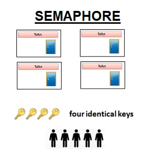

# 개요
[Process](/blog/posts/operatingsystem/os-processs/) Synchronization은 프로세스가 사용하는 자원에 대한 동기화를 이야기한다. 여기서 헷갈릴 수 있다.

분명히 Process는 격리되어 있다고 했는데?

맞다. Process는 메모리 구조에서 만큼은 Thread와 반대로 격리되어있다. 하지만, 컴퓨터에는 많은 자원이 있다. 모니터, 파일, 비휘발성 메모리 등등 우리는 이 자원들을 Shared Resouce(공유자원)라고 부른다.

이러한 Shared Resouce에 대해서 두개 이상의 프로세스가 접근을 한다면 어떻게 될까?

멀티 프로그래밍 환경에서 A Process가 조작하다가 대기 상태로 전환되고 B Process가 올라왔고, B Process가 A Process가 조작하던 Shared Resouce를 조작하려고한다. 그렇게 되면 Shared Resource의 일관성이 박살이 날 것이다.

아래의 그림을 참고해보자.

## Race Condition

Race Condition는 경쟁 상태라는 말이다. 즉, 두개의 Process가 한개의 Shared Resource를 두고 경쟁상태가 된것이다. 동시에 접근 시도를 하여 결과 값에 일관성을 깨거나 다른 문제를 일으키게 된다.

그렇다면, 이를 해결하기 위해선 어떤 방식을 사용해야할까?

## Process Synchronization(프로세스 동기화)

Process Synchronization를 통해 해당 상황을 막을 수 있다. 그렇다면 Race Condition이 발생한 이후에 어떤 영역에서 일관성을 해치는 걸까?

### Critical Section

Critical Section은 2개 이상의 Process가 Shared Resouce에 접근할떄 Sequence에 따라 결과 값이 달라지는 영역이다. 즉, 임계영역에서 일관성이 개박살이 나는 것이다.

돌아가서, 우리는 Critical Section에서 일관성이 개박살이 나는 것을 막아야한다. DeadLock이 발생하는 조건에 대해서 같이 복습하며 생각해보자. 어떻게 막을 수 있을까?

총 3가지 조건을 만족해야한다.

1. 상호배제: 하나에 하나씩, Critical Section에 Process가 들어가 있을때 다른 Process는 접근이 불가다.
2. 한정대기: 특정 프로세스가 영원히 Critical Section에 들어가지 못하면 안된다.
3. 융통성: 한 Process가 다른 Process의 일을 방해해서는 안된다.

어려운 조건은 아니다. 가장 좋은 비유는 화장실이다.

1. 상호배제: 화장실 칸에 누군가 들어가 있다. 그러니 난 못들어간다.
2. 한정대기: 화장실 칸에서 누군가 들어가서 안나오면 안된다. 급똥을 참을 수 없다.
3. 융통성: 화장실 칸에 누군가 들어있다고 문을 부실듯 치면 안된다.(쾅쾅)

이렇게 되면 이해가 쉽다. Critical Section이 화장실 칸이고 누군가가 다른 Process이며, 내가 기다리는 Process이다.

그렇다면, 화장실칸에 내가 들어갔다. 어떻게 화장실문을 잠그지(lock)?

### Mutex(뮤텍스) lock

상호배제가 Mutex인데 Mutex라고 표현하기 헷갈리니 Mutex Lock이라고 표현을 하겠다.

Mutex Lock는 한칸짜리 화장실이라고 생각하면된다. 그냥 잠금 장치를 lock하고 외부에서 그 잠금장치가 unlock이 될때까지 기다렸다가 내가 들어가서 lock하면 된다.

### Semaphore(세마포어)

Semaphore도 Mutex를 활용한다. 세마포어는 정수형태로 이루어져 있어. 해당 정수는 공유자원에 접근할 수 있는 Process의 허용치를 이야기한다.
Process가 공유자원을 1개 사용하고 있으면 허용치에서 -1을 한다. Mutex와 차이가 있다. **Mutex는 Lock구조로 동작을 하고 Semaphore는 Signal 구조로 동작한다는 것이다.**
이게 Mutex와 Semaphore의 가장 큰 차이이다.

만약 다 사용중이라면? 해당 정수 값은 0이 된다.  

Mutex가 한칸짜리 화장실이라면, Semaphore는 방 여러칸이 있고, 원격지에서 사용할 수 있는 화장실의 갯수가 있다는 것을 아는 전광판이 하나가 있는 것이다.
그래서 그 전광판에 1이 되면 들어갈 자리가 있다는 것이다.

또한, Binary Semaphore와 Counting Semaphore로 나눌 수 있다. Binary는 한칸짜리 방이 있는 Mutex와 비슷하게 동작을 한다. 위에서 설명했듯이 차이는 Lock이냐 Signal이냐의 
그 차이이다. **Counting Semaphore는 위에서 설명한 예시와 동일하다. 즉, 허용치가 1이상의 숫자를 가질 수 있다.**

### Monitor(모니터)

Monitor도 Semaphore의 상호배제 로직을 추상화하여 구현하고 Shared Resource에 대한 Interface만 제공해준다. Semaphore를 추상화 함으로써 Semaphore를 구현하기 쉬워지고
실수가 줄어들 것이다. JAVA와 같이 고급 수준의 언어를 사용하다보면 Synchronized 키워드를 사용하게 되는데 해당 키워드가 Monitor를 사용함을 말한다. 공유 자원에 접근하는 것을 Queue에 하나씩 쌓아두고
한번에 하나씩 Process가 Critical Section에 접근할 수 있도록한다.

---
# FINAL
Process 동기화는 무결성을 위해서 필수적이다. 또한, Muti Thread 환경 위주의 개발 환경이 많아지고 있다. 이러한 상황에서 상호배제를 제대로 이해해야한다고 생각한다. Syn를 맞추는 것을 일반적으로 생각하지 않고
Syn를 맞춘다고 생각하자.

