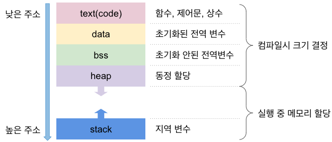

# 소개
Operating System에는 응용 프로그램을 실행시킬 수 있다. Kernel 영역에서 자원을 할당받아
다양한 응용프로그램을 OS위에서 실행시킨다.  

Program(응용 프로그램)은 단순히 OS에 작성되어있는 Soure Code에 불과하다.
이를 실행하게 되면 우리는 그것을 Process라고 부른다. 여기서 Program과 Proccess의 차이를 이해할 수 있다.
다시 설명하자면, 자원을 할당받아 실행중인 Program을 Proccess라고 부른다.  
<span style="background-color: blue;">(Process is a Program in execution)</span>

위키백과를 살펴보면 아래와 같이 표현한다.
> 💡 Process란?
> 
> 프로그램은 일반적으로 하드 디스크 등에 저장되어 있는 실행코드를 뜻하고, Process는 프로그램을 구동하여 프로그램 자체와 프로그램의 상태가 메모리 상에서 실행되는 작업 단위를 지칭한다.  
> 예를 들어, 하나의 프로그램을 여러 번 구동하면 여러 개의 Process가 메모리 상에서 실행된다. 
> 프로세스(process)는 컴퓨터에서 연속적으로 실행되고 있는 컴퓨터 프로그램을 말한다.  
> 종종 스케줄링의 대상이 되는 작업(task)이라는 용어와 거의 같은 의미로 쓰인다. 여러 개의 프로세서를 사용하는 것을 멀티프로세싱이라고 하며 같은 시간에 여러 개의 프로그램을 띄우는 시분할 방식을 멀티태스킹이라고 한다. Process 관리는 운영 체제의 중요한 부분이 되었다.

그렇다면 excution(실행중)은 어떤 의미인지 고민해봐야한다.  
Program을 Source Code 상태로 저장해둔다는 의미는 "기억장치"에 소스코드를 저장한다는 것을 의미한다. 이를 실행시키기 위해서
우리는 Kernel한테 excution을 위한 Memory를 요청한다. 그리고 Program을 Process로 만들기 위해서 메모리 공간에 올린다.  
이를 Excution이라고 말한다.  

여기까지 이해를 했다면 구조, state를 살펴보자

---
# Detail

## PCB(Process Context/Control Block)


Process를 학습하다보면 Context, PCB와 같은 용어들이 나온다. PCB는 Context를 포함하고 있는 프로세스를 관리하는 데이터 structure다.
상태전이가 일어나거나 CPU 스케듈링으로 프로세스를 전환하는 과정에서 프로세스의 실행 정보를 저장하고 관리하는 Block이라고 볼수 있다.

### PCB의 주요 구성 요소
- Pointer
- Process State
- PID(Process ID)
- CPU Register
- PC(Program Counter)
- Memory Management Information
- Scheduling Information
- Accounting Information
- Miscellaneous

⭐ 예시
```
프로세스 ID: 101
상태: Ready
프로그램 카운터: 0x004000
레지스터: {AX: 10, BX: 20, ...}
메모리 정보: {페이지 테이블: ...}
스케줄링 정보: {우선순위: 5}
입출력 정보: {파일 디스크립터: ...}
계정 정보: {CPU 시간: 120 ms}
```
### Context 구성 요소
- Process State
- PC(Program Counter)
- Pointer

⭐ 예시
```
프로그램 카운터: 0x004000
레지스터: {AX: 10, BX: 20, ...}
스택 포인터: 0x0000FF
```

이렇게 Context는 PCB의 일부라고 볼 수 있다.

---
## Process Status (5가지 상태)


### New (생성)
Process가 생성된 상태이며 아직 실행 준비가 되지 않아, OS에서 초기화 중이다.
### Ready (준비)
Process가 메모 등 필요한 자원을 받았다. CPU를 대기열(Queue)에서 기디라고 있다.
### Running (실행)
Process가 CPU를 점유하고 있어 Process의 명렁어를 실행하고 있다.  
*한개의 코어당 하나씩 실행한다.
### Blocked/Waiting (대기)
Process가 입출력 완료등 특정 이벤트를 기다리는 상태이다.
### Exit/Terminated (종료)
Process의 실행이 완료된 상태를 이야기한다.

---
## Status Transition (상태 전이)
OS가 프로세슬르 관리할때 Process가 다양한 상태를 전환하게 된다. Process의 실행, 자원 요청, 입출력 대기등에서
상태 전이가 발생하게된다. 6가지의 Transition이 일어난다.

### Admit (New ➡️ Ready)
- 생성된 Process가 실행 준비를 마치는 상태전이
- 메모리와 같은 필수 자원이 할당되고, 프로세스 제어블록 (PCB)가 초기화된다. 그리고 Ready Queue에 들어간다.
### Dispatch (Ready ➡️ Running)
- 준비된 프로세스가 CPU를 할당받아 상태전이
- CPU 스케듈러에 의해 선택된 프로세스는 CPU를 점유하고 실행을 시작한다. Context Switching이 발생하여 CPU 레지스터, 프로그램 카운터 등을 해당 프로세스로 교체한다.
> 💡 Context와 Context Switching  
> Context의 의미는 다음과 같다.  
> "작업을 중단하고 나중에 동일한 지점에서 계속 할 수 있도록 저장해야하는 작업에서 사용하는 최소한의 Data set"
>
> 이를 Switch한다는 것은 무슨 의미일까?
>
> Process를 교환(Swap)한다는 이야기다. 우리가 처음 코딩을 배울때 "데이터의 스왑"하는 방법에 대해서 배운다. A와 B를 스왑하기 위해서는
> 별도의 공간이 필요하다. A를 빈공간에 넣고 A가 위치했던 공간에 B를 넣고 B가 있던 공간에 A를 넣는다.  
> 바로, Context Swithching도 똑같다. 현재의 Process 상태를 저장하고 다음 Process를 선택하고, 새로운 Process 상태를 로드한다. 이 과정에서
> 자원의 Cost가 발생하는데 우리는 이를 Overhead라고 부르기로 했다.  
> 더 자세한 내용은 CPU 스케듈링을 참고하자.
### Timeout (Running  ➡️ Ready)
- 현재 Process의 상태가 저장되고, 컨텍스트 스위칭을 통해 CPU가 다른 Process에게 할당됩니다.
  Process는 준비 큐에 다시 들어가 다음 CPU 할당을 기다린다. 여기서 헷갈리면 안되는데 대기가 아닌 준비 상태로 간다는 것이다.
### Event Wait (Running  ➡️ Blocked/Waiting)
- Process가 특정 이벤트로 인해 대기 상태로 전이
- Waiting Queue에 들어가서 입출력 요청 작업과 특정 이벤트를 기다리기 위해서 대기 상태로 전이되며 다른 Process에게 CPU가 할당된다.
  특정이벤트가 종료되면 자원이 준비되면서 다시 "Ready Status"로 간다. 이 점을 알고 있어야한다. 바로 Running이 아닌 Ready상태로 간다.
### Event Occurs (Blocked/Waiting  ➡️ Ready)
- Process가 대기 Queue에 있다가 필요한 이벤트가 종료가 되면 Ready로 전이
- Waiting Queue에서 Ready Queue로 간다. 준비상태에서 CPU 스케듈링에 의해서 CPU를 받기를 기다린다.
### Release (Running  ➡️ Exit/Terminated)
- Process가 종료되는 상태 전이
- PCB 제거 및 메모리 자원 회수 진행이된다. Parent Process가 종료된 Process의 결과를 수집한다.

---
## 할당받는 메모리 구조

메모리 구조는 프로그램이 실행될 때 OS할당 받는 메모리 Layout을 의미한다. 그리고 이를 Segment로 나눌 수 있다.


```
+--------------------+
| Command-Line Args  |
| and Environment    |
+--------------------+
|       Stack        |  <- 높은 주소
+--------------------+
|       Heap         |  <- 증가하는 방향
+--------------------+
|   Uninitialized    |
|    Data (BSS)      |
+--------------------+
|   Initialized Data |
+--------------------+
|      Code          |  <- 낮은 주소
+--------------------+
```


### Code Segment
Code Segment는 실행 가능한 코드가 저장되는 메모리 영역이다.  
해당 영역은 Read Only 영역으로 설정되어 있어 코드가 수정되지 않도록 보호된다. 많은 운영체제는 여러 Process가
동일한 코드를 공유할 수 있도록 이 부분을 공유 메모리로 설정할 수 있게 되어있다.
#### Example
- 프로그램의 함수 코드 및 명령어
- 기계어로 번역된 바이너리 코드

### Data Segment
Data Segment는 전역 변수와 정적 변수를 저장하는 메모리 영역이다.  
이 세그먼트는 초기화된 데이터와 초기화 되지 않은 데이터로 나눌 수 있다.
#### 초기화 된 데이터
명시적으로 초기화된 전역 변수와 정적 변수가 저장되는 메모리 영역

#### 예시
```cpp
int variable = 100; //초기화된 전역 변수
static int variable = 199; //초기화된 정적 변수
```

#### BSS(Block Started by Symbol) - 초기화되지 않는 데이터
BSS 세그먼트는 초기값이 지정되지 않는 전역 변수와 정적 변수가 저장되는 메모리 영역이다. 프로그램 시작시 0으로 초기화된다.
#### 예시

```cpp
int variable; //초기화된 전역 변수
static int variable; //초기화된 정적 변수
```

> 💡 정적 변수
>
> 전역변수의 장점을 갖고 있으면서 외부에서 불필요한 접근을 방지할 수 있어 프로그램의 모듈성을
> 높이는데 매우 유용하다.

### Heap Segment
Heap 세그먼트는 Dynamic Memory에 할당에 사용되는 메모리 영역입니다. C에서 사용되는 키워드인
"malloc" , "calloc" , "relloc' 등과 같은 메모리 할당 함수에 의해 관리될 수 있다.
- 역할: 동적 메모리 할당
- 특징: 크기 변동 가능, 명시적 메모리 관리

### Stack Segment
Stack 세그먼트는 함수 호출시 자동으로 할당되는 지역 변수와 함수의 변환 주소를 저장하는 메모리 영역이다.  
스택은 "후입선출(LIFO)"구조로 관리되며 함수가 호출될때마다 새로은 Fram을 쌓아 함수가 종료되면 해당 Frame을 
pop한다.

#### 주요특징
- Heap 과 Stack은 서로 반대 방향으로 성장한다. Stack은 높은 주소에서 낮은 주소로, Heap은 낮은 주소에서 높은 주소로 성장한다.
> 💡 Stack: top down VS. Heap: bottom up
> 
> 이렇게 설계된 이유는 메모리 관리와 다양한 메모리 할당 요구사항을 처리하기 위힘이다.  
> 힙과 스택이 서로 반대로 성장하게 되면 서로 독립적으로 확장이 가능하며 충돌하지 않는다. 큰 메모리를 연속적으로 할당할 수 있다.
> 스택은 주로 지역변수와 함께 함수의 호출 정보를 다룬다. 즉, 작은 크기의 데이터를 다룬다고 볼 수 있다. 하지만, 힙 영역에서는 대규모 데이터, 특히나 객체
> 를 할당할때 사용이 된다.


---
# FINAL
Process의 전반적인 구조와 상태를 알아보았다. PCB구조, 상태 및 상태전이, 할당받는 메모리 구조에 대해서 다양한 용어들과
그 용어들간의 관계도 알아보았다. CPU 스케듈링은 CPU를 어떻게 효율적으로 나누어서 Process에게 전달하냐 이 과정을 다룬다.
우리는 지금 PC를 멀티태스킹으로 쓰고 있지만, 이렇게 발전하기 까지 엄청난 기술력이 동원된것 같은 느낌을 많이 받는다.  
그저 경이롭다...!