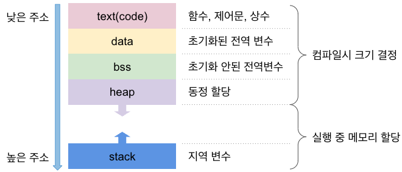
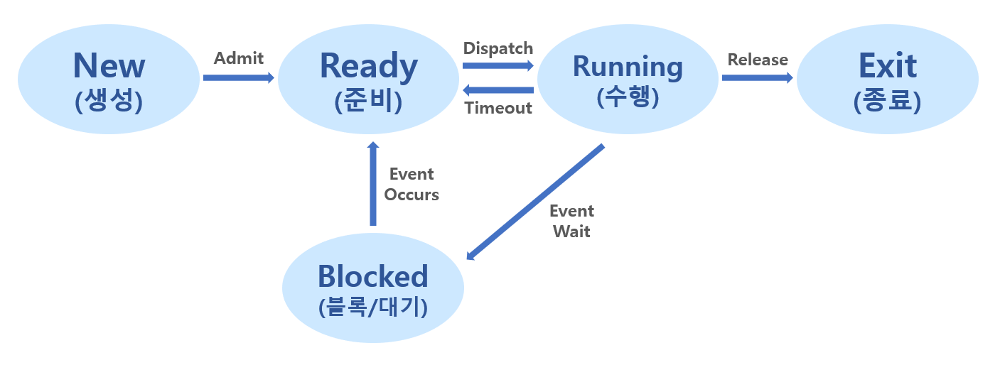

# 소개
Operating System에는 응용 프로그램을 실행시킬 수 있다. Kernel 영역에서 자원을 할당받아
다양한 응용프로그램을 OS위에서 실행시킨다.  

Program(응용 프로그램)은 단순히 OS에 작성되어있는 Soure Code에 불과하다.
이를 실행하게 되면 우리는 그것을 Process라고 부른다. 여기서 Program과 Proccess의 차이를 이해할 수 있다.
다시 설명하자면, 자원을 할당받아 실행중인 Program을 Proccess라고 부른다.  
<span style="background-color: blue;">(Process is a Program in execution)</span>

위키백과를 살펴보면 아래와 같이 표현한다.
> 💡 Process란?
> 
> 프로그램은 일반적으로 하드 디스크 등에 저장되어 있는 실행코드를 뜻하고, 프로세스는 프로그램을 구동하여 프로그램 자체와 프로그램의 상태가 메모리 상에서 실행되는 작업 단위를 지칭한다.  
> 예를 들어, 하나의 프로그램을 여러 번 구동하면 여러 개의 프로세스가 메모리 상에서 실행된다. 
> 프로세스(process)는 컴퓨터에서 연속적으로 실행되고 있는 컴퓨터 프로그램을 말한다.  
> 종종 스케줄링의 대상이 되는 작업(task)이라는 용어와 거의 같은 의미로 쓰인다. 여러 개의 프로세서를 사용하는 것을 멀티프로세싱이라고 하며 같은 시간에 여러 개의 프로그램을 띄우는 시분할 방식을 멀티태스킹이라고 한다. 프로세스 관리는 운영 체제의 중요한 부분이 되었다.

그렇다면 excution(실행중)은 어떤 의미인지 고민해봐야한다.  
Program을 Source Code 상태로 저장해둔다는 의미는 "기억장치"에 소스코드를 저장한다는 것을 의미한다. 이를 실행시키기 위해서
우리는 Kernel한테 excution을 위한 Memory를 요청한다. 그리고 Program을 Process로 만들기 위해서 메모리 공간에 올린다.  
이를 Excution이라고 말한다.  

여기까지 이해를 했다면 구조, state를 살펴보자

---
# Detail
## 메모리 구조

메모리 고즈는 프로그램이 실행될 때 OS할당 받는 메모리 Layout을 의미한다. 그리고 이를 Segment로 나눌 수 있다.


```
+--------------------+
| Command-Line Args  |
| and Environment    |
+--------------------+
|       Stack        |  <- 높은 주소
+--------------------+
|       Heap         |  <- 증가하는 방향
+--------------------+
|   Uninitialized    |
|    Data (BSS)      |
+--------------------+
|   Initialized Data |
+--------------------+
|      Code          |  <- 낮은 주소
+--------------------+
```


### Code Segment
Code Segment는 실행 가능한 코드가 저장되는 메모리 영역이다.  
해당 영역은 Read Only 영역으로 설정되어 있어 코드가 수정되지 않도록 보호된다. 많은 운영체제는 여러 프로세스가
동일한 코드를 공유할 수 있도록 이 부분을 공유 메모리로 설정할 수 있게 되어있다.
#### Example
- 프로그램의 함수 코드 및 명령어
- 기계어로 번역된 바이너리 코드

### Data Segment
Data Segment는 전역 변수와 정적 변수를 저장하는 메모리 영역이다.  
이 세그먼트는 초기화된 데이터와 초기화 되지 않은 데이터로 나눌 수 있다.
#### 초기화 된 데이터
명시적으로 초기화된 전역 변수와 정적 변수가 저장되는 메모리 영역

#### 예시
```cpp
int variable = 100; //초기화된 전역 변수
static int variable = 199; //초기화된 정적 변수
```

#### BSS(Block Started by Symbol) - 초기화되지 않는 데이터
BSS 세그먼트는 초기값이 지정되지 않는 전역 변수와 정적 변수가 저장되는 메모리 영역이다. 프로그램 시작시 0으로 초기화된다.
#### 예시

```cpp
int variable; //초기화된 전역 변수
static int variable; //초기화된 정적 변수
```

> 💡 정적 변수
>
> 전역변수의 장점을 갖고 있으면서 외부에서 불필요한 접근을 방지할 수 있어 프로그램의 모듈성을
> 높이는데 매우 유용하다.

### Heap Segment
Heap 세그먼트는 Dynamic Memory에 할당에 사용되는 메모리 영역입니다. C에서 사용되는 키워드인
"malloc" , "calloc" , "relloc' 등과 같은 메모리 할당 함수에 의해 관리될 수 있다.
- 역할: 동적 메모리 할당
- 특징: 크기 변동 가능, 명시적 메모리 관리

### Stack Segment
Stack 세그먼트는 함수 호출시 자동으로 할당되는 지역 변수와 함수의 변환 주소를 저장하는 메모리 영역이다.  
스택은 "후입선출(LIFO)"구조로 관리되며 함수가 호출될때마다 새로은 Fram을 쌓아 함수가 종료되면 해당 Frame을 
pop한다.

#### 주요특징
- Heap 과 Stack은 서로 반대 방향으로 성장한다. Stack은 높은 주소에서 낮은 주소로, Heap은 낮은 주소에서 높은 주소로 성장한다.
> 💡 Stack: top down VS. Heap: bottom up
> 
> 이렇게 설계된 이유는 메모리 관리와 다양한 메모리 할당 요구사항을 처리하기 위힘이다.  
> 힙과 스택이 서로 반대로 성장하게 되면 서로 독립적으로 확장이 가능하며 충돌하지 않는다. 큰 메모리를 연속적으로 할당할 수 있다.
> 스택은 주로 지역변수와 함께 함수의 호출 정보를 다룬다. 즉, 작은 크기의 데이터를 다룬다고 볼 수 있다. 하지만, 힙 영역에서는 대규모 데이터, 특히나 객체
> 를 할당할때 사용이 된다.

## Process의 상태


