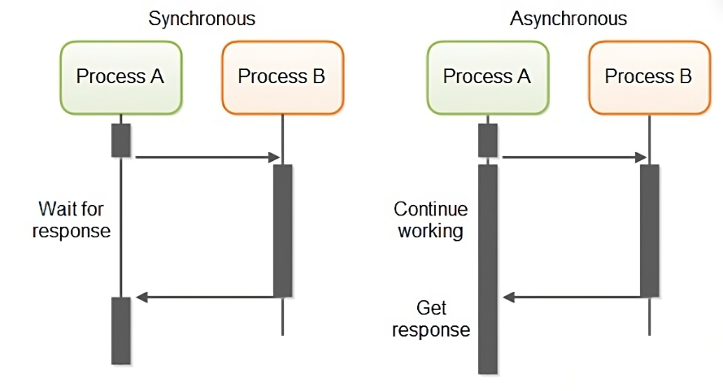
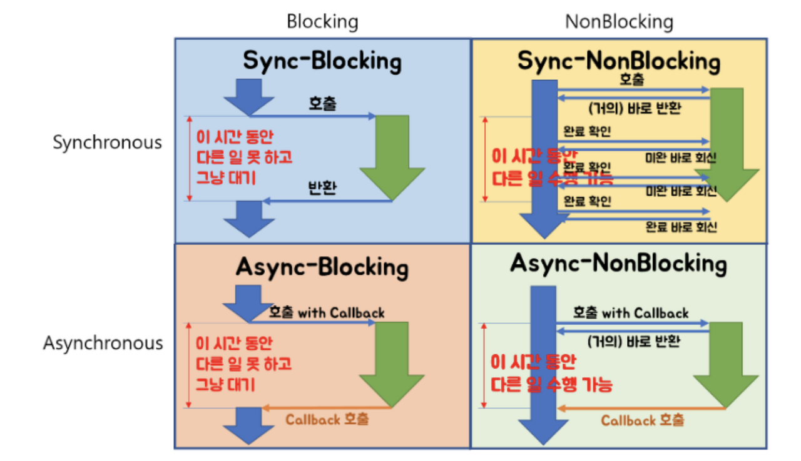

# 동기(synchronization)& 비동기(Asynchronous)

동기화는 우리가 옛날 아이팟(iPods)을 사용하여 애플의 전용 소프트웨어인 `아이튠즈`를 사용했을때, `동기화`를 만났다.
`동기화`만 되면 음원파일이나, 저장되어있던 이미지들이 통째로 날라가기도 했고, 매우 오랜시간 동기화를 했던 기억이 있다.  

## 데이터 관점에서 동기(synchronization)
동기화가 무엇을 의미하는 것일까?  

쉽게 설명하자면, `데이터의 일치화`를 의미한다. 도대체 이 작업을 왜하는 것일까?  

데이터의 일관성을 유지하기 위한 행위라고 판단 할 수 있다. A가 가진 데이터와 B가 가진 `데이터를 일치화`를 한다는 것이다.

`데이터 일치화`하는 방법에 대해서 고민을 해보면 동기화의 `동기(Sync)`를 이해하기 쉽다.

데이터를 일치화 중에 다른 갑자기 동기화 중인 데이터가 변화해도 될까?  

당연히 안된다. 식당을 생각해보자.  

나는 짜장면이 먹고 싶어서 서버분께 짜장면 하나를 주문했고 곧바로 주방장님은 짜장면 조리를 시작하셨다.
갑자기 내가 짬뽕이 먹고 싶어져서 짬뽕으로 주문을 변경하겠다고 말했다.

그러면 짜장면을 짬뽕으로 변경할 수 있을까?  
대부분 주방에서는 거절을 하거나, 바꾸더라도 짜장면으로 만들어지는 과정중의 재료는 버려질 것이다.  

`동기`도 마찬가지이다. 데이터의 일관성을 해치는 행위는 받아드려지지 않는다. 즉, `동기`는 내가 짜장면을 받아야지 완료되는 작업이다.

## Process관점에서 동기(synchronization)
데이터 관점에서 바라본 관점은 위의 예시에 적합하다. 근데 짜장면을 먹는 `나(Process A)`에서는 어떨까?

짜장면을 시켰다. 그리고 주방장이 `짜장면을 조리(Process B)`될때 까지, `짜장면이 나오면 나는 식사(Process A 진행)`를 한다.

기다린다는 것에 집중해보자. 나는 Process적 관점에서 `동기`는 나는 `기다리는 동안(Process B)` 어떠한 행위를 할 수 없다.
그저 짜장면이 나올때까지 기다리는 것이다.

즉, Process가 `순차적인 행위`를 해야한다는 것이다. 주문하고 식사를 하기까지 그 중간과정엔 어떠한 행위도 할 수 없다.

## Process관점에서 비동기(Asynchronous)

비동기는 그렇다면 무엇일까? 실제로 짜장면을 주문한 `나(Process A)`은 어떻게 동작할까?

`나(Process A)`는 짜장면을 주문하고, 젓가락도 셋팅하고, 물도 마시고, 휴대폰도하면서 기다린다. `주방장님이 짜장면을 조리(Process B)`한다.
그리고 서버분이 내앞에 짜장면을 갖다주시면 그제야 식사를 시작한다.
이게 바로 `비동기`이다.

`순차적인 행위`에서 `Process A`를 하면서 `Process B`를 하는 것을 의미한다.

아래의 그림을 보자

Process 관점에서 `비동기 동작은 매우 효율적으로 동작`한다. 당연히 데이터 관점에서 비동기는 애초에 발생하면 안된다.

|   구분   | 동기(Synchronous)                                                                   | 비동기(Asynchronous)                                                                       |
|:------:|-----------------------------------------------------------------------------------|-----------------------------------------------------------------------------------------|
| **장점** | 구현이 간단함     코드가 직관적이며, 디버깅이 용이함        작업 순서가 명확하여 유지보수가 쉬움               | 자원을 효율적으로 사용 가능   응답 시간이 빠름    사용자 경험이 개선됨 (UI가 멈추지 않음)                         |
| **단점** | 자원을 비효율적으로 사용         작업이 완료될 때까지 다른 작업이 `블로킹` 됨          응답 시간이 길어질 수 있음 | 구현이 상대적으로 복잡함              디버깅이 어렵고 코드의 흐름을 파악하기 어려움     `콜백 지옥`이나 복잡한 에러 처리 필요 |

장단점을 살펴보니 `블로킹`, `콜백(Callback)`이 등장했다. 이건 또 무슨 말인가?

# 블로킹(Blocking)& 논블로킹(Non-Blocking)

JS코드를 공부하다보면 동기, 비동기를 `Blocking`과 `Non-Blocking`을 혼용해서 작성하는 경우가 많다. 사실 이 둘은 가장 큰 차이점이 있다.
바로 행위를 정의하는 것에서 차이가 있다.

위에서 설명한것처럼 동기와 비동기는 `순차적` 즉, `순서`에 따른다. `Process A`가 실행중 중간에 `Process B`가 들어오면 중단 한다? 안한다?.

블로킹(Blocking)& 논블로킹(Non-Blocking)은 조금 다르다. `함수의 제어권`에 따른 행위가 있다.

즉, 외부 함수가 제어권을 달라고 하면 안주는 것이 Blocking을 의미한다.

배구를 메타포 삼아` 공`을 `함수제어권`이라고 생각해보자.
내부에서 내가 `공`을 갖고 있다면 `함수의 제어권`을 내가 갖고 있는 것이다.

공을 넘기고 안넘기는 것은 `함수의 제어권`을 가진 팀의 특권이다.

함수의 제어권을 갖고 있는 다면 `블록킹`. 함수의 제어권을 넘겨주고 바로 다른 행위(공격 포지션, 방어 포지션 등등)를 준비하면`논블록킹`이라고 할 수 있다.

- 블로킹: 배구에서 서브를 넣은 후, 상대의 리턴을 기다리며 다른 동작을 하지 못하는 상황. 제어권이 상대 팀에게 넘어가고, 서브 팀은 아무 것도 하지 못하는 상태.
- 논블로킹: 공을 넘겨주고, 곧바로 다음 동작을 준비하며 계속 경기를 진행하는 상황. 제어권을 잃지 않고 계속 움직이며, 다른 작업을 수행할 수 있는 상태.

## 콜백(Callback)

프로그래밍에서 함수나 메소드로, 다른 함수가 실행된 후 나중에 호출되는 함수를 의미합니다.  
주로 `비동기 작업`에서 많이 사용되며, 특정 작업이 완료된 후에 그 결과를 처리하거나 후속 작업을 실행하기 위해 사용됩니다.

즉, 함수의 제어권을 다시 돌려받기 위한 작업을 의미한다.

`비동기 작업`은 진행을 하다보면 순차성이 꼬여버릴 수 있다. 원하는 값을 얻지 못한 상태에서 다른 함수나 process가 실행되거나 할 수도 있지만,
이를 방지하기 위해서 `콜백` 작업이 필수적이다.

- 비동기 작업 처리: 비동기 프로그래밍에서, 예를 들어 서버에 데이터를 요청한 후 응답이 올 때까지 기다리지 않고 다른 작업을 할 수 있습니다. 응답이 도착하면 콜백 함수가 호출되어 그 응답을 처리합니다.
- 순차적 작업 실행: 앞의 작업이 끝난 후에만 실행되어야 할 작업이 있을 때, 이를 콜백 함수로 구현합니다.

아래의 그림은 2x2로 Sync, Async, Blocking, Non-Blocking으로 나눈 그림이다.

# FINAL

바닐라 JS나 JQuery를 공부하다보면 ajax, axios 등등 비동기 방식의 처리나 promise, await, async 키워드와 같은 키워드들이 동작한다.
이때 콜백의 정의, 비동기의 정의, 더 나아가 요즘 트렌드라고 할수 있는 버츄얼 쓰레드와 같은 기술들을 이해하는 것에 쉬울 수 있고, 고민할 수 있을 것 같다.