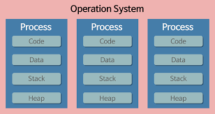
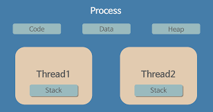

# Thread란?

## 개요
이전 포스팅에서 [Process]("https://black9769.github.io/blog/posts/operatingsystem/os-processs/")에 대한 설명을 알아봤다.  
자주 나오는 면접 질문중에 용어를 비교하는 질문이 많이 나온다.  

**Process VS. Thread**  

궁극적으로 이 질문이 중요한 이유와 질문에 대답하는 방법에 대해서 궁극적으로 알아보겠다.

---
| Process                                | Thread                                |
|----------------------------------------|---------------------------------------|
|  |  |

## Thread와 Process의 차이
우리가 이전 Process의 포스팅에서 마지막 목록에 메모리 구조를 할당받는 것을 알아보았다. 짧게나마 다시 설명하자면 메모리 구조에서 Stack의 역할은
함수 호출시 자동으로 할당되는 지역 변수와 함수의 변환 주소를 저장하는 메모리 영역이다.  

**Thread는 Process의 메모리 구조에서 Stack을 제외한 나머지 메모리 영역을 공유한다.**  

이게 Process와 Tread간의 가장 큰 차이점이다.  
### 그렇다면 왜? Stack을 제외한 나머지 구조만 할당받도록 설계되었을까?  

답변은 매우 간단하다. 메모리 사용의 최적화의 관점에서 보면 데이터를 효율적으로 접근 할 수가 있기 때문이다.  
그렇다면 또 다른 질문이 나올 수 있다. 굳이 Stack 영역만? 분리하게 된 이유는?  

이전에 짧게 요약을 했던 Stack 영역의 역할을 보면 알 수 있다.
**함수관련 반환, 지역변수 담당** 보이는 것 처럼 stack은 지역이나 함수 관련 반환과 같은 개별적으로 관리하는데 사용되는
메모리 부분이다. 그래서 이런 Stack영역을 통해 Thread를 분리 할 수 있다.  

우리는 3가지를 알 수 있었다.
1. Process와 다르게 Thread는 Stack영역을 제외한 나머지 메모리 구조를 공유한다.
2. Stack영역만 제외된 이유는 Stack영역에 저장되는 데이터 특성때문이다.
3. Thread의 독립적 특성은 Stack영역에 의해서 분리된다.

### 예시

블로그 글이나 외국 개발자들이 작성한 글들을 보다보니 적절한 예시가 있다. 아래의 내용을 치환해보자

> 💡  
> Process ➡️ 은행  
Thread ➡️ 은행의 상담창구     
Stack 영역 ➡️ 상담내용     
Code Segment, Data Segment 와 같은 공유 자원 ➡️ 돈   

나는 은행에 방문을 했다. 그리고 대출 관련 상담을 받기 위해 상담창구로 향하여 상담을 진행했다.
상담은 매우 독립적인 상황에서 일어났다. 담당창구에 들어서게 되면 다른 담당의 창구 직원이 나에게 말을 할 수 없다.
그리고 나는 상담 창구에서 면담후에 돈을 빌리고 은행에 나섰다.  

자, 여기까지 일어보면 무슨 예시인지 이해가 간다.  
**Process에서 Stack영역을 독립적으로 할당 받은 Thread가 다른 영역을 공유해줬다.**  

아래는 다른 예시이다.

나는 은행에 방문을 했다. 상담을 받기위해 상담창구를 향했다. 옆자리에 수상한 사람이 앉아있었고, 알고보니 그 남자는 은행강도였다.
그래서 은행의 온 창구가 마비가 되었다. 은행이 폐쇄가 된다는 안내방송이 나왔고 나는 뛰어서 은행 밖으로 나왔고, 다음 블럭에 있는 은행으로 갔다.  

**여기서의 예시는 Thread가 비정상적인 동작으로 인해 주변의 Thread가 강제 종료가 되었다. 그래서 Process도 종료 되었다.
하지만, 다음 Process는 정상적으로 동작한다.**

자, 여기서 Thread와 Process의 차이가 1가지 더 등장했다.
1. Thread는 공유 자원이 있기 때문에 한개의 Thread가 비정상적인 동작으로 인해 종료가 되면 다른 Thread도 강제 종료가 된다. 하지만 Process는 앞단의 Process가 강제 종료되더라도 다음 Process는 정상동작을 한다.

뭐 사실 위에서 창구가 하나라면 괜찮았겠지만 은행에 대부분 창구는 여러개이다.
그리고 우리는 이걸 **Multi Thread**라고 부른다.

---

Thread와 Process는 개인적으로 은행과 창구를 비교하면서 설명하면 어느정도의 설명을 다 할 수 있다고 생각한다.
여러가지 이해를 할 수 있는 예시 설명들이 많이 있으니 이해가 안간다면 더 찾아볼 수 있도록하자.
