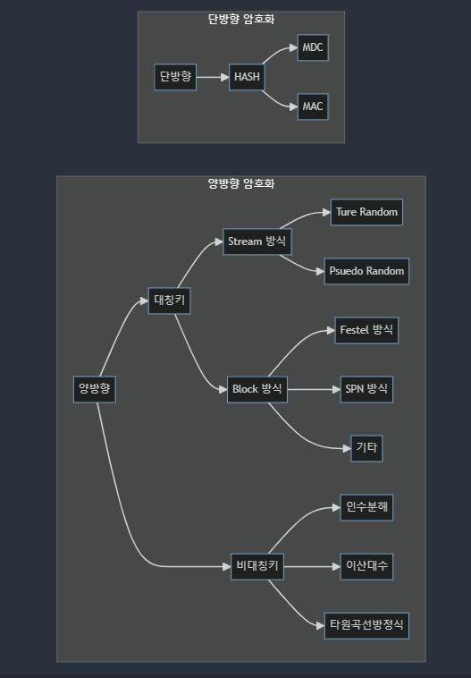

# 개요
정보보안 업무를 수행하다보면 아주 딥하지는 않지만, 얕게는 알고 있어야하는 암호관련 이론들이 있다.
이 포스팅에서는 아주 얕은 암호학에 대해서 알아볼 것이고, 암호학을 이야기할때 자주 등장하는 Alice와 Bob도 자주 등장할 예정이다.

## 암호학
일단, 암호학에서 Text와 Ciphertext, Encryption, Decryption 의 정의에 대해서 알아보자.

- Text: 평문을 의미하며, 날것이다.
- Ciphertext: 암호문으로, 암호화된 평문이다.
- Encryption: 암호화로, 평문을 암호문으로 변경한다.
- Decryption: 복호화로, 암호문을 평문으로 변경한다.

그렇게 어려운 정의는 아닌데 대게 복호화랑 암호화를 많이 헷갈린다.

## 암호화

암호화는 총 2가지의 단방향/양방향 암호화 분류로 나눌 수 있다. 
양방향 암호화는 대칭키/비대칭 암호화 방식으로 나눌 수 있다.

먼저, 단방향 암호화 부터 천천히 살펴보자

### 단방향 암호화
단방향은 무슨 뜻을 의미하는 것일까??

단방향은 한쪽 방향으로만 암호화 한다는 것을 의미한다. 키포인트는 암호화만 가능하고 복호화는 불가능하다는 것이다.
좋은 예시로 우리가 웹사이트에 가입할때를 생각해보면 된다.  

비밀번호를 잃어버렸다면, 찾아서 내 비밀번호는 ~ 입니다. 라고 하지 않는다.
그냥 새로 만들어서 Overwrite 시킨다.

단방향 암호화 기법에서 잘 알려진 방법은 Hash알고리즘을 활용한 방법이다.  

> 💡 Hash는 무슨 뜻이지?
>
> 해쉬브라운을 먹어보았다면, Hash의 뜻이 이해가 갈 것이다. 해쉬브라운이 원재료가 김자인줄 알고 있었을까?
> 그냥 먹기만 했다면 아마 몰랐을 것이다. 그래서 Hash는 사전적으로 "뭉게다. 짓이기다" 라는 뜻을 갖고 있다.

Hash의 뜻을 알았으면 단방향과 Hash를 서로 연결하는 것은 매우 쉬울 것이다. Text(평문) 자체를 Hash해버리는 것이니깐!

Hash 알고리즘도 2가지로 세분화 할 수 있다.

- MDC(Modification Detection Code)
  - 데이터  무결성을 판단
  - Key없음, 출처확인 불가
  - SHA(Secure Hash Algorithms) -1,2 MD5, HAVAL

- MAC(Message Authentication Code)
  - 메세지 인증[디지털 서명]
  - Key 있음
  - HMAC, NMAC, CBC-MAC

Hash 알고리즘에 대한 자세한 이야기도 있지만, 이번 포스팅의 취지는 어떤 암호화기법이 있는지 확인해보기 위함으로 생략하겠다. "Hash는 복호화가 불가능하다"
라는 것만 알고 있으면 된다.

즉, Alice가 Bob에거 Hash된 값(Ciphertext)을 보내면 Bob은 Alice의 Text를 알 수 없다.

### 양방향 암호화
양방향 암호화는 단뱡향 처럼 암호화 뿐만이 아닌 복호화도 가능한 암호화를 말한다. 여기서 Decryption하기 위한 Key가 필요한데 
이를 대칭키/비대칭키로 두개로 나눈다.

- 대칭 암호화 (Symmetric Encryption)
    - 특징
      - 단일키 사용: 암복호화의 키가 1개이다.
      - 비대칭 암호화에 비해 상대적으로 빠르다.
      - 키 분재의 어려움이 있고, 키가 유출되면 데이터가 노출된다.
    - 예시
      - AES: ): 현재 널리 사용되는 표준 대칭 암호화 알고리즘입니다. 128, 192, 256 비트 키 길이를 지원하며 빠르고 강력한 보안을 제공합니다.
      - DES
      - 3DES
> ⭐ Alice와 Bob의 대칭 암호화  
> 
> Alice가 Bob에게 기밀 메세지를 보내고 싶다. Bob만이 이 메시지를 복호화할 수 있도록 설계한다.
> 1. 먼저 비밀키를 생성한다. 그리고 Alice와 Bob이 만들어진 비밀키를 공유한다. 중요한 사항은 절대로 외부 노출이되선 안된다.
> 2. Alice는 비밀키 기반으로 메시지를 암호화하여 Bob에게 전송한다.
> 3. Bob은 Alice에게 받은 암호화를 받아서 공유받은 비밀키로 복호화한다.

여기까지가 양방향 암호화의 대칭키(비밀키) 방식을 설명한 것이다. 매우 일상생활과 비슷하다. 도어락을 하나 설명하고 가족들이 그 도어락 비밀번호를 공유한다.

- 비대칭 암호화 (Asymmetric Encryption)
  - 특징
    - 키 사용: 공개 키는 암호화에, 비공개 키는 복호화에 사용됩니다.
    - 보안: 키 분배 문제를 해결하지만, 속도가 느립니다.
    - 신뢰성: 공개 키 인프라(PKI)를 통해 키의 신뢰성을 보장할 수 있습니다.
  - 예시
    - RSA
    - ECC
> ⭐ Alice와 Bob의 비대칭 암호화  
> **#S1 기밀 메시지 전달**  
> 
> Alice가 Bob에게 기밀 메세지를 보내고 싶다. Bob만이 이 메시지를 복호화할 수 있도록 설계한다.
> 1. Bob이 공개키를 배포한다. Bob은 비대칭 암호화 키 쌍을 생성한다.
>    - 공개키: 모든 사람들이 볼 수 있는 키(복호화가 불가능핟)
>    - 비공개키: Bob만 알고 있는 키
> 2. Bob은 Alice에게 공개키를 전달한다. 공개키는 누구나 접근이 그낭하며, 암호화하는데 사용된다.
> 3. Alice는 Bob이 전달해준 공개키를 사용하여 메시지를 암호화하여 전달한다.
> 4. Bob은 매세지를 받아 비공개키로 복호화한다.

> ⭐ Alice와 Bob의 비대칭 암호화  
> **#S2 디지털 서명 (위변조 탐지)**
>
> Alice가 메시지를 서명하여 Bob에게 보냅니다. Bob은 서명을 검증하여 메시지가 Alice에게서 온 것임을 확인하고, 내용이 변조되지 않았음을 보장합니다.
> 1. Alice는 비대칭 암호화키를 생성한다.
>    - 공개키: 모든 사람들이 볼 수 있는 키(복호화가 불가능핟)
>    - 비공개키: Alice만 알고 있는 키
> 2. Alice는 메시지의 해시 값을 계산한 후, 비공개 키를 사용하여 서명을 생성합니다.
> 3. Alice가 서명을 Bob에게 보낸다.
> 4. Bob은 Alice가 생성한 공캐키로 서명을 검증한다.
> 5. 검증이 성공하면 Alice에게 온 서명임을 확인하고 변조가 되지 않음을 확인할 수 있다.

대칭키, 비대칭키는 학습하다보면 어려운 이론은 아니다. 디지털 서명이 조금 난해하긴한데, 결론적으로 공개키, 비공개키로 나누어서 공개키는
암호화에만 비공개키에는 복호화에만 사용됨을 알고 있으면 이해가 쉽다.  

---

# FINAL
학습을 하면서 가장 중요한 것은 용어별로 잘 정리해서 나누는 것이다. 비대칭키 암호화를 공개키 방식이라고 부르며, 대칭키 방식을 비밀키 암호기법이라고
부르기도 한다. 하지만, 두개가 다 같은 말임을 알고 특징을 잘 이해하고 Alice와 Bob의 기밀메시지 전달방법에 대해서 전반적으로 알고 있으면 이해하고
암기하기 쉽다!

