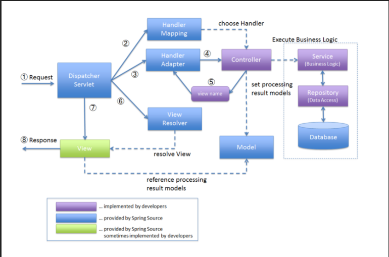

# 개요

Spring Framework는 전자정부프레임워크의 기본적인 Base이다. 그래서 많은 개발자들이 스프링 프레임워크를 사용한다.  
Spring Framework의 대표적인 패턴중에는 MVC패턴이 있다. 

- Model
- View
- Controller

이 세가지를 합쳐서 MVC 패턴이라고 한다. 안드로이드를 학습하다보면 MVVM이라는 패턴도 들어볼 것이다. 
즉 디자인 패턴에서도 배웠지만, 패턴을 형성하는 이유는 개발 및 유지보수를 용이하게 만들기 위함이다.

세가지 영역으로 책임을 분리하여 개발 및 유지보수를 용이하게 할 수있다. 그렇다면, 코드를 작성중에 이슈가 생겼다.

이슈가 생기는 책임영역이 Controller인지, Model인지, View인지 알기 위해서 우리는 MVC 패턴이 어떻게 동작하는지 알아야한다.

아래의 글을 잘 따라오자.

## 동작원리

1. 클라이언트의 요청  
   사용자가 웹 브라우저를 통해 요청을 보내고, HTTP Request의 형태로 서버로 전송이된다.
2. DispatcherServlet 도달  
   클라이언트의 요청은 가장 먼저 디스패쳐서블릿 도달하게 된다. 
> 💡 DispatcherServlet
> 
> DispatcherServlet은 Spring MVC 패턴에서 `프론트 컨트롤러`이다. 즉, 모든 요청을 중앙에서 처리할 수 있는 컨트롤러다.
> 또한, DispatcherServlet은 Request를 처리하기 위해 여러 구성요소와 협력한다.

3. Handler Mapping  
   `DispatcherServlet`은 요청 URL 기반으로 적절한 `Controller`를 찾기 위해 `Handler Mapping`을 사용하게 된다. `Handler Mapping`은 요청 URL와 `Controller를 Mapping`한다
4. Handler Adapter  
   `DispatcherServlet`은 Controller를 Handler Mapping을 통해 찾았고 `Handler Adapter를 사용하여 요청을 실제로 처리할 Controller Methods를 호출`한다.  즉, `HandlerAdapter`는 컨트롤러 메서드가 올바르게 호출되도록 중개 역할을 합니다.
5. Controller
    `Handler Adapter`는 매핑된 `Controller methods` 호출하고, `Controller`는 비즈니스로직을 수행하여 `Model Data`를 준비한다.
   또한, `Controller`에 의해 처리된 `Model Data`를 `View 이름`과 함께 반환한다.
6. View Resolver
   `DispatcherServlet`은 `View Resolver`를 사용하여 `Controller`가 반환한 `View 이름`을 실제 View 객체로 변환한다. `View Resolver`는 View의 물리적인 위치를 찾기 위해 이름을 사용한다.
7. View
    반환된 View 객체는 `Model Data`와 함께 사용자에게 표시할 결과를 랜더링한다.
8. 서버 응답
    랜더링된 `View`는 최종적으로 HTML이나 JSON 양식으로 변환되어 클라이언트의 요청에 응답으로 전송이 된다.

즉, 순서를 단위별로 요약하면  

클라이언트의 요청 ➡️ DispatcherServlet ➡️ Handler Mapping ➡️ Handler Adapter ➡️ Controller ➡️ View Resolver ➡️ View ➡️ 서버 응답

### 심화된 답변 예시

사용자가 웹 브라우저를 통해 HTTP 요청을 보내면 이 요청은 Spring MVC의 프론트 컨트롤러인 `DispatcherServlet`에 도달합니다.

`DispatcherServlet`은 모든 요청을 중앙에서 관리하는 역할을 합니다. 프론트 컨트롤러 패턴을 구현한 것인데요, 이를 통해 요청의 처리 로직을 일관되게 유지할 수 있습니다.

다음으로, `DispatcherServlet`은 `HandlerMapping`을 통해 요청 URL에 맞는 컨트롤러를 찾습니다. 이 과정에서 다양한 매핑 전략을 사용할 수 있습니다. 예를 들어, 어노테이션 기반의 `@RequestMapping`을 사용하거나, XML 설정을 사용할 수도 있죠.

컨트롤러를 찾고 나면, `HandlerAdapter`를 사용하여 실제로 해당 컨트롤러의 메서드를 호출합니다. 이 때, `HandlerAdapter`는 컨트롤러의 메서드를 호출하기 전에 필요한 설정을 적용하고, 호출 후에는 결과를 처리할 수 있게 해줍니다.

컨트롤러 메서드가 호출되면, 여기서 비즈니스 로직을 수행하고, 처리 결과를 `Model` 객체에 담아서 반환합니다. 이 `Model` 객체는 뷰에서 사용될 데이터를 담고 있습니다. 함께 반환되는 뷰 이름은 `ViewResolver`에 의해 실제 뷰로 변환되는데요, 예를 들어, `ThymeleafViewResolver`나 `InternalResourceViewResolver` 등을 사용할 수 있습니다.

변환된 뷰 객체는 `Model` 데이터를 이용해서 사용자에게 보여줄 최종 결과를 렌더링합니다. 이 때, JSP, Thymeleaf 등 다양한 뷰 템플릿 엔진을 사용할 수 있습니다.

렌더링된 결과는 HTML, JSON, XML 등 클라이언트가 기대하는 형식으로 변환되어 `DispatcherServlet`을 통해 응답됩니다.